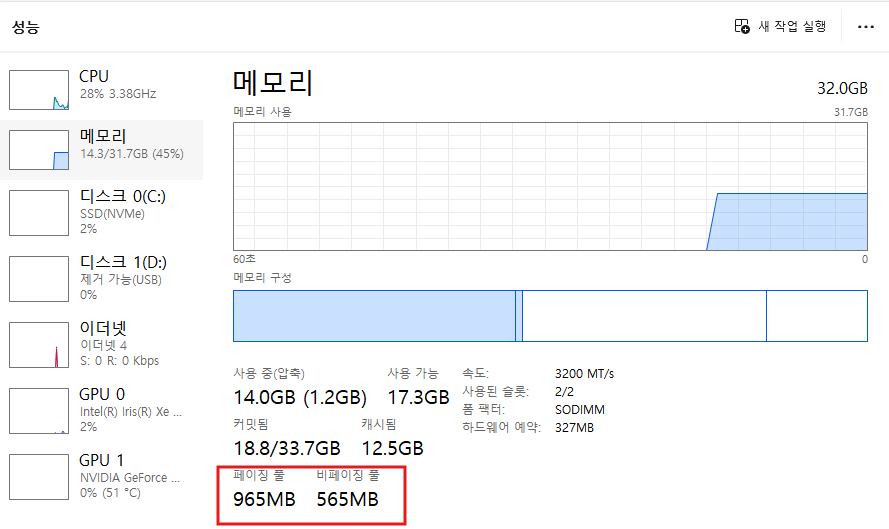

# 가상 메모리: 소프트웨어로 구현한 무한 메모리 환상

## 🧠 가상 메모리의 기본 개념

### **Virtual = Logical: 논리적 메모리 구현**

가상 메모리의 핵심 아이디어:
"소프트웨어로 메모리를 구현한다"

물리적 현실:
RAM: 8GB (제한된 실제 메모리)

논리적 환상:
각 프로세스마다 4GB의 독립된 메모리 공간
(32비트 시스템 기준, 64비트는 훨씬 더 큼)

결과:
10개 프로세스 × 4GB = 40GB의 "가상" 메모리 공간
실제 물리 메모리는 8GB만 존재

### **작업 관리자에서 보이는 메모리 구조**
  

```
`Windows 작업 관리자 메모리 정보:

┌─────────────────────────────────────┐
│         Physical Memory             │
│  ┌─────────────────────────────────┐ │
│  │        사용 중: 6.2GB          │ │  ← 실제 RAM 사용량
│  │        사용 가능: 1.8GB        │ │
│  │        총합: 8.0GB             │ │
│  └─────────────────────────────────┘ │
├─────────────────────────────────────┤
│          Virtual Memory             │
│  ┌─────────────────────────────────┐ │
│  │     페이징 풀: 2.1GB           │ │  ← Paged Pool
│  │     비페이징 풀: 512MB         │ │  ← Non-Paged Pool
│  │     커밋된 메모리: 12.5GB      │ │  ← 할당된 가상 메모리
│  └─────────────────────────────────┘ │
└─────────────────────────────────────┘

핵심 관찰:
커밋된 메모리(12.5GB) > 물리 메모리(8.0GB)
→ 가상화를 통해 더 많은 메모리 사용 중!`
```

## 📄 페이지(Page): 메모리의 최소 관리 단위

### **페이지의 정의와 특성**

페이지(Page)란?
메모리를 관리하는 최소 단위 블록

특성:
- 크기: 일반적으로 4KB (4,096 바이트)
- 고정 크기: 모든 페이지는 동일한 크기
- 주소 정렬: 페이지 경계에 맞춰 정렬
- 권한 단위: 읽기/쓰기/실행 권한을 페이지별로 설정

왜 4KB인가?
- CPU 캐시 라인과의 효율적 매핑
- 메모리 관리 오버헤드와 효율성의 균형점
- 하드웨어 MMU(Memory Management Unit) 지원

페이지 vs 블록:
페이지: 논리적 메모리 단위 (가상 메모리)
블록: 물리적 저장소 단위 (디스크)

### **페이징과 비페이징의 차이**

```

`페이징 풀 (Paged Pool):
┌─────────────────────────────────────┐
│            RAM                      │
│  ┌─────────┐ ┌─────────┐           │
│  │ Page 1  │ │ Page 3  │  ← 자주 사용 │
│  └─────────┘ └─────────┘           │
└─────────────────────────────────────┘
         ↕ Swap 가능
┌─────────────────────────────────────┐
│            HDD                      │
│          ┌─────────┐                │
│          │ Page 2  │  ← 덜 사용하는 페이지 │
│          └─────────┘                │
└─────────────────────────────────────┘

특징:
- 메모리 부족 시 HDD로 이동 가능
- 상대적으로 덜 중요한 데이터
- 성능보다 메모리 효율성 우선

비페이징 풀 (Non-Paged Pool):
┌─────────────────────────────────────┐
│            RAM                      │
│  ┌─────────┐ ┌─────────┐ ┌────────┐ │
│  │Critical │ │Drivers  │ │Kernel  │ │  ← 항상 RAM 유지
│  │ Data    │ │ Code    │ │ Code   │ │
│  └─────────┘ └─────────┘ └────────┘ │
└─────────────────────────────────────┘
         ↕ Swap 불가능

특징:
- 절대 HDD로 이동하지 않음
- 시스템 크리티컬한 데이터
- 즉시 접근이 필요한 코드/데이터
- 예: 인터럽트 핸들러, 드라이버 코드`
```

## 💿 페이징 파일: HDD를 RAM처럼 사용

### **페이징 파일의 동작 원리**

페이징 파일 (Paging File / Swap File):
"하드디스크의 일부를 RAM처럼 사용하는 영역"

Windows: pagefile.sys (보통 C:\pagefile.sys)
Linux: swap partition 또는 swap file

동작 과정:
1. 물리 메모리 부족 상황 발생
2. OS가 덜 사용되는 페이지들을 선별
3. 선별된 페이지들을 페이징 파일로 이동
4. 확보된 물리 메모리를 새로운 작업에 할당
5. 이전 페이지 필요 시 다시 RAM으로 로드

파일 위치와 크기:
Windows 기본값: 물리 메모리 크기의 1.5배
예: 8GB RAM → 12GB pagefile.sys

### **실제 시나리오: RAM 8GB에서 12개 프로세스 실행**

```
`초기 상태 (RAM 8GB):
┌─────────────────────────────────────┐
│        Physical Memory (8GB)        │
│  ┌──┐┌──┐┌──┐┌──┐┌──┐┌──┐┌──┐┌──┐   │
│  │P1││P2││P3││P4││P5││P6││P7││P8│   │  ← 8개 프로세스 실행 중
│  └──┘└──┘└──┘└──┘└──┘└──┘└──┘└──┘   │
└─────────────────────────────────────┘

새 프로그램 실행 요청 (P9, P10):
문제: RAM 공간 부족!

해결책: 페이징 메커니즘 활용
┌─────────────────────────────────────┐
│        Physical Memory (8GB)        │
│  ┌──┐┌──┐┌──┐┌──┐┌──┐┌──┐┌──┐┌──┐ │
│  │P3││P4││P7││P8││P9││P10│    │   │ │  ← 활성 프로세스들
│  └──┘└──┘└──┘└──┘└──┘└───┘    └───┘ │
└─────────────────────────────────────┘
↓ Swap Out
┌─────────────────────────────────────┐
│         Paging File (HDD)           │
│  ┌──┐┌──┐┌──┐┌──┐                  │
│  │P1││P2││P5││P6│  ← 덜 사용되는   │  ← 덜 사용되는 프로세스들
│  └──┘└──┘└──┘└──┘     프로세스들    │
└─────────────────────────────────────┘

결과: 12개 프로세스가 모두 동작하는 것처럼 보임!`
```

## 🗺️ 가상 메모리 공간 (VMS)의 구조

### **프로세스별 독립된 메모리 공간**

```
`Chrome 프로세스의 가상 메모리 공간 (4GB 예시):

┌─────────────────────────────────────┐
│     Chrome Virtual Memory Space     │
│           (4GB 가상 주소)           │
├─────────────────────────────────────┤
│           User Mode                 │  ← 3GB (32비트 Windows)
│  ┌─────────────────────────────────┐ │
│  │        Stack (스택)             │ │  ← 0xC0000000
│  │         ↓                       │ │
│  │         ...                     │ │
│  │         ↑                       │ │
│  │        Heap (힙)                │ │
│  │  ┌─────────────────────────────┐ │ │
│  │  │   Chrome 실행 코드          │ │ │  ← 0x00400000
│  │  │   (chrome.exe)              │ │ │
│  │  └─────────────────────────────┘ │ │
│  └─────────────────────────────────┘ │
├─────────────────────────────────────┤
│           Kernel Mode               │  ← 1GB
│        (시스템 영역)                │
└─────────────────────────────────────┘

핵심 포인트:
- Chrome은 자신이 4GB 전체를 독점하고 있다고 "생각"
- 실제로는 필요한 부분만 물리 메모리에 매핑
- 다른 프로세스의 존재를 전혀 모름`
```

### **페이지 단위 매핑의 실제**

```
`Chrome의 4GB 가상 공간을 4KB 페이지로 분할:
4GB ÷ 4KB = 1,048,576개 페이지

실제 사용 패턴:
┌─────────────────────────────────────┐
│        Chrome 가상 메모리           │
│  ┌────┐┌────┐┌────┐┌────┐┌────┐   │
│  │Page││Page││Page││Page││Page│...│  ← 1,048,576개 페이지
│  │ 1  ││ 2  ││ 3  ││ 4  ││ 5  │   │
│  └────┘└────┘└────┘└────┘└────┘   │
└─────────────────────────────────────┘
↓     ↓     ↓     ↓     ↓
RAM   HDD   RAM   RAM   HDD    ← 실제 위치

매핑 테이블 (페이지 테이블):
가상 페이지 1 → 물리 RAM 주소 0x12340000
가상 페이지 2 → HDD 페이징 파일 오프셋 0x4000
가상 페이지 3 → 물리 RAM 주소 0x56780000
가상 페이지 4 → 물리 RAM 주소 0x9ABC0000
가상 페이지 5 → HDD 페이징 파일 오프셋 0x8000

Chrome 프로세스는 이 매핑을 전혀 모름!
OS가 모든 변환을 투명하게 처리`
```

## 🔄 페이지 스왑 (Swap) 메커니즘

### **Page-Out (Swap-Out): RAM → HDD**

```
`MS Word 실행 시나리오:

1. 사용자가 Word 실행 요청
2. OS가 Word를 위한 메모리 공간 필요
3. 현재 RAM 사용률 확인: 95% 사용 중
4. 페이지 교체 알고리즘 실행

LRU (Least Recently Used) 알고리즘:
┌─────────────────────────────────────┐
│           Current RAM               │
│  ┌──────┐┌──────┐┌──────┐┌──────┐  │
│  │Chrome││Game  ││Music ││System│  │
│  │Pages ││Pages ││Pages ││Pages │  │
│  │최근사용││오래됨││오래됨││중요함│  │
│  └──────┘└──────┘└──────┘└──────┘  │
└─────────────────────────────────────┘
↓ 선택된 페이지들
┌─────────────────────────────────────┐
│         Paging File                 │
│  ┌──────┐┌──────┐                  │
│  │Game  ││Music │  ← Swap Out      │
│  │Pages ││Pages │                  │
│  └──────┘└──────┘                  │
└─────────────────────────────────────┘

결과: Word를 위한 RAM 공간 확보`
```

### **Page-In (Swap-In): HDD → RAM**

```
`사용자가 게임으로 다시 전환하는 경우:

1. 게임 창 클릭
2. 게임 페이지들이 페이징 파일에 있음을 OS가 확인
3. Page Fault 발생 (페이지 결함)
4. Page-In 프로세스 시작

Page-In 과정:
┌─────────────────────────────────────┐
│         Paging File                 │
│  ┌──────┐┌──────┐                  │
│  │Game  ││Music │                  │
│  │Pages ││Pages │                  │
│  └──────┘└──────┘                  │
└─────────────────────────────────────┘
↓ 게임 페이지들 선택
┌─────────────────────────────────────┐
│           Current RAM               │
│  ┌──────┐┌──────┐┌──────┐┌──────┐  │
│  │Chrome││Word  ││Game  ││System│  │
│  │Pages ││Pages ││Pages ││Pages │  │  ← 게임 페이지 복원
│  └──────┘└──────┘└──────┘└──────┘  │
└─────────────────────────────────────┘

사용자 경험:
- 게임 창 클릭 → 잠깐 딜레이 → 게임 화면 복원
- 딜레이 이유: HDD에서 RAM으로 데이터 로딩 시간`
```

### **페이지 교체 알고리즘들**

1. FIFO (First In, First Out):
   가장 오래 전에 로드된 페이지부터 교체
   구현 간단하지만 효율성 낮음

2. LRU (Least Recently Used):
   가장 오랫동안 사용되지 않은 페이지 교체
   실용적이고 효율적, 대부분 OS에서 사용

3. LFU (Least Frequently Used):
   사용 빈도가 가장 낮은 페이지 교체
   사용 패턴이 일정한 경우 효과적

4. Clock (Second Chance):
   LRU의 근사치, 하드웨어 구현 용이
   페이지에 참조 비트 사용

실제 Windows 구현:
- Modified Page Writer: 변경된 페이지를 지연 쓰기
- Working Set Manager: 프로세스별 메모리 사용량 관리
- Balance Set Manager: 전체 시스템 메모리 균형 유지

## 🛡️ 프로세스 격리와 보안

### **완벽한 메모리 공간 분리**

가상 메모리를 통한 프로세스 격리:

Process A (Chrome):
가상 주소 0x12345678 → 물리 주소 0xAABBCCDD

Process B (Game):  
가상 주소 0x12345678 → 물리 주소 0x11223344

동일한 가상 주소, 완전히 다른 물리 위치!

침입 시도 시나리오:
1. 악성 프로세스가 다른 프로세스 메모리 접근 시도
2. MMU (Memory Management Unit)가 주소 변환 수행
3. 페이지 테이블에서 권한 검사
4. 권한 없는 접근 → Page Fault (보호 위반)
5. OS가 Access Violation 예외 발생
6. 악성 프로세스 강제 종료

```
보안 메커니즘:
┌─────────────────────────────────────┐
│        Virtual Address              │
│         (프로세스가 봄)             │
├─────────────────────────────────────┤
│         Page Table                  │  ← OS만 제어 가능
│    (주소 변환 + 권한 테이블)        │
├─────────────────────────────────────┤
│       Physical Address              │
│        (실제 하드웨어)              │
└─────────────────────────────────────┘

→ 프로세스는 페이지 테이블을 직접 조작할 수 없음
→ 모든 메모리 접근이 OS의 통제 하에
```

### **운영체제 보호**

```
커널 공간 보호:

User Mode Process:
┌─────────────────────────────────────┐
│        User Virtual Space           │
│     (0x00000000 ~ 0x7FFFFFFF)      │  ← 접근 가능
├─────────────────────────────────────┤
│       Kernel Virtual Space          │
│     (0x80000000 ~ 0xFFFFFFFF)      │  ← 접근 불가
└─────────────────────────────────────┘
```

``보호 메커니즘:
1. 페이지 테이블에서 커널 페이지는 User Mode 접근 차단
2. CPU 권한 링 (Ring 0 vs Ring 3) 검사
3. 잘못된 접근 시 General Protection Fault 발생

결과:
- 사용자 프로그램 오류가 OS까지 영향 주지 못함
- 시스템 안정성 크게 향상
- 악성코드의 권한 상승 공격 차단

## 📈 자원 효율성과 성능 최적화

### **메모리 사용률 최적화**

```
`물리 메모리 8GB로 수십 개 프로그램 실행 가능한 이유:

1. 프로그램의 실제 사용 패턴:
   ┌─────────────────────────────────────┐
   │     Chrome (4GB 할당)               │
   │  실제 사용: 800MB (20%)             │  ← 대부분 미사용
   │  나머지: 3.2GB는 필요시에만 할당     │
   └─────────────────────────────────────┘

2. 지역성의 원리 (Locality of Reference):
    - 시간적 지역성: 최근 사용한 메모리를 다시 사용
    - 공간적 지역성: 인접한 메모리 영역을 함께 사용

   결과: 전체 할당 메모리 중 일부만 활발히 사용
   → 나머지는 페이징 파일로 이동 가능

3. Working Set 개념:
   각 프로세스가 현재 활발히 사용하는 페이지 집합
   보통 전체 할당 메모리의 10-30%

실제 메모리 사용 예시:
물리 RAM 8GB:
- Chrome Working Set: 400MB
- Word Working Set: 200MB
- Game Working Set: 1.2GB
- System Working Set: 800MB
- 기타 10개 프로그램: 각 50MB = 500MB
  총 사용: 3.1GB (여유 공간: 4.9GB)

→ 더 많은 프로그램 실행 가능!`
```

### **성능 최적화 기법들**

```
`1. 사전 페이징 (Prefetching):
사용자가 요청하기 전에 미리 필요할 페이지들을 로드

예시: 게임 로딩
- 현재 레벨 데이터 로드 중
- 동시에 다음 레벨 데이터도 백그라운드 로드
- 사용자가 다음 레벨 진입 시 즉시 이용 가능

2. 메모리 압축 (Memory Compression):
   잘 사용되지 않는 페이지를 압축하여 RAM에 유지

   Windows 10+ 압축 스토어:
   ┌─────────────────────────────────────┐
   │            Physical RAM             │
   │  ┌──────┐┌──────┐┌──────────────┐  │
   │  │Active││Active││  Compressed  │  │
   │  │Pages ││Pages ││    Store     │  │  ← 압축된 페이지들
   │  └──────┘└──────┘└──────────────┘  │
   └─────────────────────────────────────┘

   장점: HDD 접근보다 빠른 압축 해제

3. 메모리 맵 파일 (Memory-Mapped Files):
   파일을 메모리에 직접 매핑
   읽기/쓰기가 메모리 접근처럼 동작

   활용: 대용량 데이터베이스, 이미지 파일 처리

4. NUMA (Non-Uniform Memory Access) 최적화:
   멀티 CPU 시스템에서 가까운 메모리 우선 할당`
```

### **SSD vs HDD에서의 페이징 성능**

페이징 파일 위치에 따른 성능 차이:

HDD 페이징:
- 평균 접근 시간: 10ms
- 순차 읽기 속도: 150MB/s
- 페이지 스왑 시 눈에 띄는 지연

SSD 페이징:
- 평균 접근 시간: 0.1ms  (100배 빠름)
- 순차 읽기 속도: 500MB/s (3배 빠름)
- 페이지 스왑이 거의 감지되지 않음

실사용 체감:
HDD 시스템: 프로그램 전환 시 1-3초 지연
SSD 시스템: 프로그램 전환 시 거의 즉시

권장 설정:
- SSD가 있다면 페이징 파일을 SSD에 배치
- 충분한 RAM(16GB+)이 있다면 페이징 파일 크기 최소화

## 🔍 실무에서의 가상 메모리 관리

### **시스템 관리자 관점**

메모리 모니터링 지표:

1. 페이지 폴트 빈도:
   - 높은 페이지 폴트 = 메모리 부족 신호
   - 정상: 초당 100-1000회
   - 경고: 초당 10,000회 이상

2. 페이징 파일 사용률:
   - 20% 미만: 정상
   - 50% 이상: 메모리 증설 고려
   - 80% 이상: 심각한 메모리 부족

3. Working Set 크기:
   - 각 프로세스의 실제 메모리 사용량
   - 메모리 누수 탐지 가능

최적화 방법:
- 페이징 파일 크기 조정
- 메모리 사용량 높은 프로세스 식별
- SSD로 페이징 파일 이동
- 충분한 물리 메모리 확보

### **개발자 관점**

메모리 효율적 프로그래밍:

1. 지역성 활용:
   // 좋은 예: 배열 순차 접근
   for (int i = 0; i < size; i++) {
       process(array[i]);  // 캐시 친화적
   }
   
   // 나쁜 예: 랜덤 접근
   for (int i = 0; i < size; i++) {
       process(array[random_index]);  // 캐시 미스 증가
   }

2. Working Set 최소화:
   - 사용하지 않는 대용량 데이터 해제
   - 필요시에만 메모리 할당
   - 스트리밍 방식으로 대용량 파일 처리

3. 메모리 풀 사용:
   - 빈번한 할당/해제 대신 풀에서 재사용
   - 페이지 경계 고려한 할당

4. 가상 메모리 API 활용:
   - VirtualAlloc() / mmap() 직접 사용
   - 대용량 메모리 영역의 예약/커밋 분리

### **일반 사용자 관점**

성능 최적화 팁:

1. 적절한 페이징 파일 설정:
   - 시스템 관리 크기 (권장)
   - 또는 물리 메모리의 1-1.5배

2. 메모리 모니터링:
   - 작업 관리자에서 메모리 사용률 확인
   - 80% 이상 지속시 메모리 증설 고려

3. 불필요한 프로그램 종료:
   - 시작 프로그램 정리
   - 백그라운드 프로세스 최소화

4. SSD 활용:
   - 운영체제와 페이징 파일을 SSD에 설치
   - 체감 성능 크게 향상

메모리 부족 증상:
- 프로그램 전환 시 지연
- 하드디스크 LED 지속적 점멸
- 시스템 전반적 반응 속도 저하

## 🎯 핵심 요약

### **가상 메모리의 3대 핵심 가치**

1. **완벽한 프로세스 격리**
    - 각 프로세스마다 독립된 가상 주소 공간
    - 메모리 침범 원천 차단
    - 시스템 안정성 확보
2. **시스템 보호**
    - 사용자 프로그램 오류가 OS에 영향 없음
    - 커널 공간 접근 차단
    - 권한 분리를 통한 보안 강화
3. **자원 효율성**
    - 물리 메모리보다 많은 가상 메모리 사용
    - 필요시에만 실제 메모리 할당 (지연 할당)
    - 페이징을 통한 메모리 확장

### **페이징 메커니즘**

- **페이지**: 4KB 단위의 메모리 관리 블록
- **페이징 파일**: HDD/SSD를 RAM처럼 사용하는 영역
- **Swap Out/In**: 메모리와 저장소 간 페이지 이동
- **투명성**: 프로세스는 실제 위치를 알 필요 없음