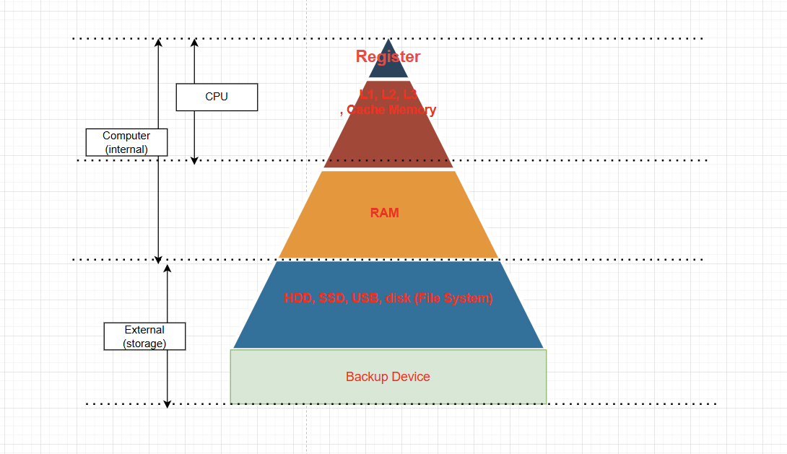

# CPU

## CPU도 당신처럼 예측하고 미리 움직인다.
  
  

### CPU 성능 향상의 변화

CPU는 연산 장치이고 속도가 빠를수록 처리량이 늘어나게 된다. 이전에는 **클럭을 증가**시켜서 성능 향상을 했다면 요즘은 **코어의 개수를 증가**시켜서 CPU 성능을 개선하고 있다.

**핵심 개념 정리**:

- **클럭(Clock)**: CPU가 명령어를 처리하는 주기. 1GHz = 초당 10억 번의 작업 수행
- **코어(Core)**: 실제 연산을 수행하는 독립적인 처리 단위. 4코어 = 4개의 CPU가 병렬 작업
- **레지스터(Register)**: CPU 내부의 가장 빠른 저장공간. 연산에 필요한 데이터를 임시 보관

**클럭 한계와 멀티코어 전환 이유**:

- **발열 문제**: 클럭이 높아질수록 전력 소모와 발열이 기하급수적으로 증가
- **물리적 한계**: 실리콘 기반 반도체의 물리적 한계에 도달 (현재 3-5GHz 수준)
- **병렬 처리**: 멀티코어로 여러 작업을 동시에 처리하는 것이 더 효율적

### 메모리 계층 구조와 속도 차이

CPU의 연산은 **코어**가 담당해서 처리하게 된다. CPU가 처리하게 되는 연산 데이터는 **RAM에 존재하는 데이터를 CPU 영역까지 옮기고 → 처리하고 → 다시 RAM에 쓰는** 일련의 과정을 반복한다.

이때 코어 안에 있는 CPU 내부 저장장치인 **레지스터의 속도와 RAM의 속도 차이**가 크게 발생한다.

**실제 속도 차이** (대략적 접근 시간):

```
레지스터:    1 cycle      (기준)
L1 캐시:     2-4 cycle    (2-4배 느림)
L2 캐시:     10-20 cycle  (10-20배 느림)  
L3 캐시:     20-40 cycle  (20-40배 느림)
RAM:         100-300 cycle (100-300배 느림)
```

일반적으로 우리보다 **100배 느리게 말하는 사람**과 정상적인 소통을 하기가 쉽지 않다. 그래서 이를 보완하기 위해서 **완충지대**를 만들었는데 그것이 **캐시 메모리**이다.

**계층별 역할**:

- **RAM**: 외부 장치인 SSD/HDD와의 완충 역할
- **캐시 메모리**: CPU 레지스터와 RAM 간의 완충 역할

즉, **캐시 메모리의 가장 큰 역할은 RAM과 레지스터의 속도 차이 극복**에 있다.

### 캐시 메모리 구조

CPU 제조사마다 L1과 L2의 차이가 있지만 보통은 아래처럼 구성되어 있다:

```
Core 0      Core 1        Core 2      Core 3
------      ------        ------      ------
L1I L1D     L1I L1D       L1I L1D     L1I L1D  ← 명령어/데이터 분리
------      ------        ------      ------
  L2          L2            L2          L2     ← 명령어/데이터 통합
--------------------------------------------------
                    L3 (Shared)                ← 모든 코어 공유
```

**캐시 레벨별 특징**:

- **L1 (Level 1)**: 명령어(Instruction)와 데이터(Data)가 **분리**되어 있음
    - L1I: 명령어 캐시 (32-64KB)
    - L1D: 데이터 캐시 (32-64KB)
- **L2 (Level 2)**: 명령어와 데이터가 **혼합**되어 있음 (256KB-1MB)
- **L3 (Level 3)**: **코어 전반적으로 공유**할 데이터들을 보관 (8-32MB)

### CPU의 예측 기능 (Branch Prediction & Prefetching)

CPU 연산이라 하면 **명령어에 대한 처리**이고, 이 명령에 필요한 **데이터는 캐시 메모리에서 가져오게** 된다. 그러면 이 **예측이라는 작업은 캐시 메모리에서 일어나는** 것이다.

**예측 시나리오 예시**:

```java
for(int i = 0; i < 100; i++){
    intArray[i] = 연산작업;
}
```

이런 작업이 있을 때 CPU는:

1. **i라는 변수가 0부터 100까지 순차적으로 증가**한다는 패턴 인식
2. **100보다 작을 때까지 반복**한다는 분기 예측
3. **배열 크기가 100개 정도 될 것**이라는 데이터 예측
4. **미리 이 배열 데이터를 캐시 메모리에 가져다 두고** 처리

**구체적인 예측 메커니즘**:

- **Branch Predictor**: 조건문(if, for, while)의 결과를 미리 예측
- **Prefetcher**: 순차적 메모리 접근 패턴을 감지하여 다음 데이터 미리 로드
- **Spatial Locality**: 현재 접근한 메모리 근처 데이터도 함께 캐시에 로드
- **Temporal Locality**: 최근 사용한 데이터를 캐시에 오래 보관

### 캐시 동작 과정

**CPU 데이터 요청 순서**:

1. CPU가 연산을 할 때 **바로 RAM에게 데이터를 요구하지 않고**
2. **먼저 캐시 메모리에게 필요한 정보를 요청**
3. CPU가 미리 예측해서 해당 데이터를 캐시 메모리에 옮겨두었으면
4. **RAM과 I/O 작업을 하지 않고 빠르게 해당 작업을 처리**

**일상생활 비유**:
마치 **연구원과 조수**가 있는데 어떤 연구를 진행하고 있다고 가정했을 때, 조수가 미리 특정 자료가 필요할 것 같아서 **도서관에 가서 미리 빌려서** 가지고 있었고, 연구원이 해당 자료를 요청했을 때 **사전에 필요할 것 같아서 빌려둔 자료를 즉시 전달**하는 것과 유사하다.

### 캐시 성능 지표

**Cache Hit (캐시 적중)**:

- 예측이 성공한 경우
- CPU가 요청한 데이터가 캐시에 존재
- **빠른 처리 속도** 달성

**Cache Miss (캐시 미스)**:

- 예측에 실패한 경우
- **L1 → L2 → L3 → RAM** 순으로 계층적 탐색
- **성능 저하** 발생

**실제 성능 영향**:

```
Cache Hit Rate 95% vs 90%의 차이:
- 전체 성능: 약 2-3배 차이
- 게임/멀티미디어: 체감 성능 차이 크게 발생
- 서버 애플리케이션: 처리량 현저한 차이
```

**캐시 최적화 프로그래밍 기법**:

- **순차 접근**: 배열을 순서대로 접근 (Spatial Locality 활용)
- **블록 단위 처리**: 데이터를 캐시 라인 크기(64바이트)로 맞춰 처리
- **루프 최적화**: 내부 루프가 캐시에 맞도록 크기 조정

이러한 **CPU의 예측 기능과 캐시 메모리 시스템**은 현대 고성능 컴퓨팅의 핵심이며, 소프트웨어 개발 시에도 이를 고려한 **캐시 친화적 프로그래밍**이 성능 최적화의 열쇠가 된다.


### PIM (Processing-In-Memory) - 메모리가 직접 연산하는 새로운 패러다임

**기존 CPU 중심 구조의 한계**:

```
CPU ↔ 캐시 ↔ RAM (데이터만 저장)
     ↑
모든 연산이 CPU로 집중
```

**PIM의 혁신적 아이디어**:

```
CPU ↔ 캐시 ↔ PIM Memory (저장 + 연산)
                    ↑
                기초 연산을 메모리에서 직접 처리
```

### PIM의 핵심 개념

**Processing-In-Memory**는 **메모리 자체에 연산 능력을 내장**하여 데이터를 CPU로 이동시키지 않고 **메모리 내부에서 직접 기초 연산을 처리**하는 기술이다.

**기존 방식의 문제점**:

- **메모리 월(Memory Wall)**: CPU-메모리 간 속도 차이가 계속 벌어짐
- **데이터 이동 비용**: 연산보다 데이터 이동에 더 많은 에너지 소모
- **폰 노이만 병목**: 명령어와 데이터가 같은 버스를 공유하여 발생하는 성능 제약

### PIM의 구현 방식

**1. Near-Data Computing**:

```
RAM Chip 내부에 간단한 프로세서 내장
├─ 기본 연산: 덧셈, 뺄셈, 비교, 논리 연산
├─ 벡터 연산: SIMD 방식의 병렬 처리
└─ 메모리 컨트롤러와 연산 유닛 통합
```

**2. In-Memory Computing**:

```
메모리 셀 자체가 연산 기능 수행
├─ ReRAM (Resistive RAM): 저항 변화로 연산
├─ MRAM (Magnetic RAM): 자기 상태로 연산  
└─ Crossbar Array: 아날로그 연산 수행
```

### 실제 활용 분야와 성능

**AI/머신러닝에서의 혁신**:

```java
// 기존 방식 (비효율적)
for(int i = 0; i < matrix_size; i++) {
    // 1. RAM에서 CPU로 데이터 이동
    // 2. CPU에서 행렬 곱셈 연산  
    // 3. 결과를 다시 RAM으로 이동
    result[i] = matrix_multiply(a[i], b[i]);
}

// PIM 방식 (효율적)
// 메모리 내부에서 직접 행렬 연산 수행
pim_matrix_multiply(matrix_a, matrix_b, result);
// 데이터 이동 없이 메모리에서 연산 완료
```

**대표적인 PIM 제품들**:

- **Samsung HBM-PIM**: 고대역폭 메모리에 연산 기능 추가
- **SK Hynix AiM**: AI 가속을 위한 PIM 메모리
- **Intel/Micron 3D XPoint**: 스토리지 클래스 메모리에 연산 기능

### 성능 향상 효과

**에너지 효율성**:

- **기존**: 데이터 이동에 전체 에너지의 60-80% 소모
- **PIM**: 데이터 이동 최소화로 **5-10배 에너지 절약**

**처리 성능**:

- **AI 추론**: 기존 대비 **2-5배 성능 향상**
- **대용량 데이터 분석**: **10-100배 빠른 집계 연산**
- **그래프 처리**: 메모리 집약적 작업에서 **획기적 성능 개선**

### 미래 전망

**PIM + 기존 CPU 캐시의 협력**:

```
CPU (복잡한 제어 로직) 
 ↕
캐시 (빠른 임시 저장)
 ↕  
PIM Memory (대용량 데이터의 기초 연산)
```

이러한 **PIM 기술**은 특히 **빅데이터, AI, 과학 계산** 분야에서 기존 CPU 중심 아키텍처의 한계를 극복하는 **게임 체인저** 역할을 하고 있으며, 앞으로 **메모리와 연산의 경계가 모호해지는** 새로운 컴퓨팅 시대를 열어가고 있다.


## CPU 예측 기능의 심각한 보안 취약점

### CPU 파이프라인과 비순차적 실행의 이해

**CPU 명령 처리 5단계**:

1. IF (Instruction Fetch): 메모리에서 명령어를 CPU로 가져옴
2. ID (Instruction Decode): 명령어 종류 파악 및 레지스터 입력
3. EX (Execute): 실제 연산 수행 (ALU 사용)
4. MEM (Memory): 필요시 메모리 접근
5. WB (Write Back): 연산 결과를 레지스터에 저장

**파이프라인을 통한 병렬 처리**:

```
클럭사이클   1   2   3   4   5   6   7
명령어1    IF  ID  EX  MEM WB
명령어2        IF  ID  EX  MEM WB
명령어3            IF  ID  EX  MEM WB
명령어4                IF  ID  EX  MEM
명령어5                    IF  ID  EX
```

한 클럭 사이클에 최대 5개 명령어를 동시에 처리할 수 있어 **성능이 5배 향상**된다.

**비순차적 실행(Out-of-Order Execution)의 필요성**:

```c
*// 의존성이 있는 명령들*
lw $t0, 0($sp)      *// 1. 메모리에서 데이터 로드*
lw $t1, 4($sp)      *// 2. 다른 메모리에서 데이터 로드*
and $s1, $t0, $t1   *// 3. 1,2번 완료 후 실행 가능*
add $s2, $t0, $s1   *// 4. 1,3번 완료 후 실행 가능*
addi $s3, $t0, 20   *// 5. 1번만 완료되면 실행 가능*
```

순차 실행하면 각 단계마다 대기 시간이 발생하지만, **5번 명령은 3,4번과 독립적**이므로 먼저 실행 가능하다:

실행 순서: 1 → 2 → 5 → 3 → 4  (2 클럭 사이클 단축!)

### Meltdown 공격의 구체적 메커니즘

**핵심 공격 코드 (x86 어셈블리)**:

```nasm
; rcx = 커널 메모리 주소, rbx = 탐지용 배열
xor rax, rax          ; rax 레지스터 초기화
retry:
mov al, byte [rcx]    ; 커널 메모리에서 1바이트 읽기 (예외 발생!)
shl rax, 0xc          ; rax에 4096(페이지 크기)을 곱함
jz retry              ; 0이면 다시 시도
mov rbx, qword [rbx + rax]  ; rax번째 페이지에 접근
```

**공격 단계별 상세 분석**:

**1단계: 비순차적 실행 악용**

```c
*// 이론상 실행되지 않아야 하는 코드*
raise_exception();  *// 항상 예외 발생// 아래 줄은 절대 실행되지 않아야 함*
access(probe_array[secret_data * 4096]);
```

하지만 **비순차적 실행**으로 인해:

- CPU가 `raise_exception()`을 처리하기 전에
- `access()` 함수를 **추측으로 먼저 실행**
- **예외가 발생하면 실행 결과만 취소**, 캐시는 그대로!

**2단계: 캐시에 흔적 남기기**

L1 캐시 상태 변화:
[실행 전] 캐시 비어있음
[추측 실행] secret_data * 4096 주소의 데이터가 캐시에 로드
[예외 처리] 실행 결과는 취소, 하지만 캐시 데이터는 유지!

**3단계: Flush-Reload 공격으로 데이터 추출**

```c
*// 모든 페이지에 접근하며 시간 측정*
for (int i = 0; i < 256; i++) {
    start_time = rdtsc();  *// CPU 타임스탬프 카운터*
    temp = probe_array[i * 4096];  *// i번째 페이지 접근*
    end_time = rdtsc();
    
    access_time = end_time - start_time;
    if (access_time < CACHE_HIT_THRESHOLD) {
        *// 빠른 접근 = 캐시에 있음 = 비밀 데이터!*
        printf("비밀 바이트: %c\n", (char)i);
    }
}
```

### Spectre 공격의 분기 예측 악용

**분기 예측(Branch Prediction) 메커니즘**:

```c
*// BHT (Branch History Table) 동작 방식*
for (int i = 0; i < 10; i++) {
    if (i < 10) {  *// CPU가 "참"이라고 지속적으로 예측 학습*
        result += 1;
    }
}
*// CPU: "아, 이 조건은 항상 참이구나!"*
```

**공격자의 악용 전략**:

```c
*// 1단계: CPU 분기 예측기 훈련*
for (int i = 0; i < 100; i++) {
    if (i < array1_size) {  *// 항상 참 → CPU가 "참" 예측 학습*
        y = array2[array1[i] * 4096];
    }
}

*// 2단계: 실제 공격*
int malicious_x = 999999;  *// 배열 범위 초과 값*
if (malicious_x < array1_size) {  *// 거짓이지만 CPU는 "참"으로 예측!// 추측 실행으로 실제로 실행됨*
    secret = array1[malicious_x];  *// 허용되지 않은 메모리 접근*
    y = array2[secret * 4096];     *// 비밀 데이터를 캐시에 남김*
}
*// 예측 실패 판명 → 실행 결과 취소, 캐시 흔적은 유지*
```

### 클라우드 환경에서의 실제 공격 시나리오

**가상화 환경 구조와 공격 경로**:

```
`┌─────────────────┐  ┌─────────────────┐  ┌─────────────────┐
│   Guest OS 1    │  │   Guest OS 2    │  │   Guest OS 3    │
│   (공격자 VM)    │  │   (피해자 VM)    │  │   (일반 VM)     │
│ ┌─────────────┐ │  │ ┌─────────────┐ │  │ ┌─────────────┐ │
│ │악성 코드    │ │  │ │기밀 데이터  │ │  │ │일반 앱      │ │
│ │실행 중      │ │  │ │처리 중      │ │  │ │            │ │
│ └─────────────┘ │  │ └─────────────┘ │  │ └─────────────┘ │
│ ┌─────────────┐ │  │ ┌─────────────┐ │  │ ┌─────────────┐ │
│ │Guest Kernel │ │  │ │Guest Kernel │ │  │ │Guest Kernel │ │
│ └─────────────┘ │  │ └─────────────┘ │  │ └─────────────┘ │
└─────────────────┘  └─────────────────┘  └─────────────────┘
──────────────────────────────────────────────────────────────
│              Hypervisor (VMM)                              │
│  ┌─────────────────────────────────────────────────────┐  │
│  │         Shared Physical Memory                      │  │
│  │   ┌─────┐   ┌─────┐   ┌─────┐   ┌─────┐             │  │
│  │   │VM1영역│   │VM2영역│   │VM3영역│   │공유캐시│     │  │
│  │   └─────┘   └─────┘   └─────┘   └─────┘             │  │
│  └─────────────────────────────────────────────────────┘  │
──────────────────────────────────────────────────────────────
│                   Host Hardware                            │
│  ┌─────┐ ┌─────┐ ┌───────────────────────────────────────┐ │
│  │CPU  │ │ RAM │ │    Shared CPU Cache (L3)             │ │
│  │Core │ │     │ │  ┌─────┐ ┌─────┐ ┌─────┐ ┌─────┐    │ │
│  │     │ │     │ │  │Cache│ │Cache│ │Cache│ │Cache│    │ │
│  │     │ │     │ │  │Line1│ │Line2│ │Line3│ │Line4│    │ │
│  └─────┘ └─────┘ │  └─────┘ └─────┘ └─────┘ └─────┘    │ │
└──────────────────────────────────────────────────────────────┘`
```

**클라우드 공격의 단계별 과정**:

**1단계: 공격자 VM에서 악성 코드 실행**

```c
*// Guest OS 1 (공격자 VM)에서 실행되는 악성 코드*
void spectre_cloud_attack() {
    *// 타겟: 다른 VM의 메모리 영역 추측 접근*
    char *target_vm2_memory = (char*)0x1000000;  *// VM2 영역 추정 주소*
    
    *// CPU 분기 예측기를 조작하여 추측 실행 유도*
    for (int i = 0; i < 1000; i++) {
        if (malicious_condition) {  *// 항상 false이지만// CPU가 추측으로 실행해버림!*
            char secret = target_vm2_memory[malicious_index];
            
            *// 비밀 데이터를 공유 캐시에 흔적으로 남김*
            flush_reload_array[secret * 256] = 1;
        }
    }
}
```

**2단계: 물리적 CPU 캐시 오염**

Guest OS 1의 추측 실행으로 인한 L3 캐시 상태 변화:

```
L3 캐시 (모든 VM이 공유):
┌─────────────────────────────────────┐
│ Cache Line 1: VM1 데이터            │
│ Cache Line 2: ★VM2 기밀데이터★      │ ← 추측 실행으로 로드됨
│ Cache Line 3: VM3 데이터            │
│ Cache Line 4: 공유 라이브러리       │
└─────────────────────────────────────┘
```

**3단계: 캐시 사이드채널 공격**

c

```c
*// 같은 공격자 VM에서 캐시 타이밍 측정*
void extract_vm_secret() {
    for (int i = 0; i < 256; i++) {
        start_time = rdtsc();  *// CPU 타임스탬프 측정*
        
        *// 캐시에 있으면 빠르게, 없으면 느리게 접근됨*
        volatile char temp = flush_reload_array[i * 256];
        
        end_time = rdtsc();
        
        if (end_time - start_time < CACHE_HIT_THRESHOLD) {
            *// 빠른 접근 = 캐시에 있음 = VM2의 기밀 데이터!*
            printf("VM2의 비밀 바이트: %c\n", (char)i);
        }
    }
}
```

**4단계: 격리 경계 우회하여 데이터 탈취**

```
정상적인 가상화 보안:
VM1 ──X──> VM2  (하이퍼바이저가 차단)

Spectre 공격:
VM1 ─┐
     │ 추측실행
     ↓
   물리 CPU ─────→ 공유 L3 캐시 ─────→ VM2 데이터 유출
     ↑                                ↑
   캐시 조작                      타이밍 분석
```

### 실제 클라우드 환경에서의 위험성

**AWS, Azure, GCP 등에서의 현실적 위협**:

공격 시나리오:
1. 공격자가 $5짜리 최소 인스턴스 구매
2. 피해자와 같은 물리 서버에 배치될 때까지 반복 생성
3. Spectre 공격으로 피해자의 메모리 스캔
4. 데이터베이스 비밀번호, API 키, 개인정보 등 탈취

**웹 브라우저에서의 공격**:

```jsx
*// 악성 웹사이트에서 실행되는 코드*
function browserSpectre() {
    *// SharedArrayBuffer를 이용한 고정밀 타이밍*
    const timer = new SharedArrayBuffer(1024);
    const timerView = new Int32Array(timer);
    
    *// 다른 탭의 메모리 영역을 추측 실행으로 접근*
    for (let i = 0; i < 1000000; i++) {
        *// CPU 추측 실행 유도*
        spectrePOC(targetMemory, i);
        
        *// 캐시 타이밍 측정으로 정보 추출*
        const timing = measureCacheAccess(probeArray[i]);
        if (timing < threshold) {
            *// 다른 탭의 비밀 정보 유출!*
            leakedData += String.fromCharCode(i);
        }
    }
}
```

### 실제 성능 영향과 대응책의 한계

**패치 적용 후 성능 저하 상세**:

작업 유형별 성능 영향:
├─ 시스템 콜 집약적: 30-50% 저하 (KPTI 페이지 테이블 분리)
├─ 가상화 환경: 최대 70% 저하 (VM 간 컨텍스트 스위칭 증가)
├─ 데이터베이스: 20-40% 저하 (메모리 접근 패턴 변화)
└─ 일반 애플리케이션: 5-15% 저하

**클라우드 제공업체의 대응책**:

- **물리적 격리**: 민감한 워크로드를 전용 하드웨어에 배치
- **마이크로코드 업데이트**: 모든 서버에 CPU 패치 적용
- **메모리 스크러빙**: VM 종료 시 메모리 완전 초기화
- **캐시 플러싱**: VM 전환 시 캐시 강제 무효화

**근본적 해결이 어려운 이유**:

```
성능 최적화 기법들의 상호 의존성:

추측 실행 ←→ 파이프라인 ←→ 슈퍼스칼라
    ↕           ↕           ↕
분기 예측 ←→ 비순차실행 ←→ 캐시 시스템

하나를 제거하면 전체 성능이 절반 이하로 저하
```

### 지속되는 위협과 새로운 변종들

**MDS (Microarchitectural Data Sampling) 계열**:

- **ZombieLoad**: CPU 내부 라인 필 버퍼에서 데이터 유출
- **RIDL**: 로드 포트와 스토어 버퍼 악용
- **Fallout**: 스토어 버퍼에서 이전 프로세스 데이터 복원

**전력 분석 공격**:

- **Platypus**: CPU 전력 소모 패턴으로 암호키 추출
- **Hertzbleed**: CPU 주파수 변화로 정보 유출

**공격의 현실적 한계**:

1. **노이즈**: 실제 환경에서는 캐시 노이즈가 많아 정확도 저하
2. **시간**: 1바이트 추출에 수 분~수 시간 소요
3. **탐지**: 지속적인 캐시 프로빙으로 인한 비정상 행동 패턴

### 미래의 보안 아키텍처

**하드웨어 차원의 근본적 해결 시도**:

```
기존 CPU: 성능 우선 → 보안 후순위
새로운 설계: 보안 우선 → 성능 최적화

```

1. 추측 실행 제한 모드
2. 하드웨어 기반 메모리 격리
3. 캐시 파티셔닝 기술
4. 암호화된 실행 환경 (Intel SGX 개선)

**종합적 대응 전략**:

하드웨어 + 소프트웨어 + 운영 차원의 다층 방어:

1. CPU 차원: 새로운 아키텍처 설계
2. 커널 차원: KPTI, SMEP/SMAP 활성화
3. 하이퍼바이저 차원: 강화된 VM 격리
4. 애플리케이션 차원: 민감 데이터 암호화
5. 운영 차원: 이상 행동 모니터링

**Zero-Trust Architecture**:

- 하드웨어도 신뢰하지 않는 보안 모델
- 모든 데이터를 암호화하여 처리
- 동형 암호화 등 새로운 기술 도입

이러한 **CPU게이트**는 단순한 버그가 아니라 **현대 CPU 설계 철학 자체의 근본적 문제**를 드러낸 사건으로, 클라우드 컴퓨팅과 가상화 보안 모델을 근본적으로 뒤흔들었으며, 앞으로 수십 년간 컴퓨터 보안과 아키텍처 설계에 지대한 영향을 미칠 **역사적 패러다임 전환점**이 되었다.