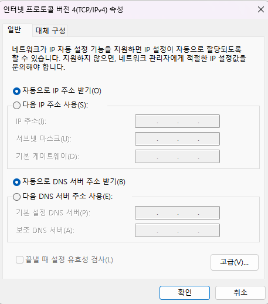

## 인터넷 설정 자동화를 위한 DHCP
  

### 인터넷 사용을 위한 필수 설정

**인터넷을 사용하기 전에 우리는 여러 설정을 해야 합니다. 인터넷이라는 네트워크에 host가 연결이 되는 건데 이 host를 유니크하게 식별할 수 있는 값을 부여해야 합니다. 그것이 IP 주소입니다.**

### IP 주소 할당의 현실

**기본적으로 IPv4라 하더라도 32비트 숫자 값이 나와야 하는데 이 숫자 값이 구체적으로 무엇인지 내가 알 수 없습니다.**

**우리가 인터넷을 그냥 임의로 사용하는 것이 아니라 돈을 지불하고 사용하고 그 인터넷이라는 서비스를 제공해주는 회사를 ISP(Internet Service Provider)라고 합니다. 그래서 ISP 쪽에서 IP 주소들을 가지고 있습니다. 그래서 내가 돈을 주고 인터넷을 사용하면 가지고 있는 주소들 중 하나를 사용할 수 있게 허락해줍니다.**

```
IP 주소 할당 체계:

글로벌 IP 주소 관리:
IANA (Internet Assigned Numbers Authority)
    ↓ 대륙별 할당
RIR (Regional Internet Registry)
    ↓ 국가별 할당  
NIR (National Internet Registry)
    ↓ ISP별 할당
ISP (Internet Service Provider)
    ↓ 고객별 할당
End User (일반 사용자)

실제 할당 예시:
┌─────────────────────────────────────────┐
│ KT: 39.7.0.0/16 (65,536개 주소)        │
│ SK브로드밴드: 61.252.0.0/16             │
│ LG유플러스: 39.117.0.0/16               │
│ → 각 ISP가 고객에게 재할당              │
└─────────────────────────────────────────┘
```

### 필수 네트워크 설정 항목

**또한 subnet mask와 gateway IP 주소 설정을 해야 합니다.**

```
L3 수준 필수 설정:

1. IP 주소 (IP Address):
   • 예시: 192.168.0.100
   • 역할: 네트워크에서 유일한 식별자
   • 형식: xxx.xxx.xxx.xxx

2. 서브넷 마스크 (Subnet Mask):
   • 예시: 255.255.255.0 (/24)
   • 역할: 네트워크 ID와 호스트 ID 구분
   • 용도: 같은 네트워크 판별

3. 게이트웨이 IP 주소 (Default Gateway):
   • 예시: 192.168.0.1
   • 역할: 다른 네트워크로의 출입구
   • 기능: 외부 통신을 위한 라우터
```

**그래서 이렇게 3가지가 L3 수준에서의 설정입니다. 여기에 DNS 서버 주소도 써줘야 합니다.**

### DNS 서버의 필요성

**예를 들어 [www.naver.com이라고](http://www.naver.xn--com-kd8ll83b1kx/) 입력을 한다면 이 주소의 IP 주소가 뭔지 DNS 서버가 나한테 알려줄 수 있습니다.(8.8.8.8 ← 구글 DNS)**

```
DNS 서버 설정:

4. DNS 서버 주소:
   • 주요 DNS 서버:
     - 8.8.8.8, 8.8.4.4 (Google)
     - 1.1.1.1, 1.0.0.1 (Cloudflare)
     - 208.67.222.222 (OpenDNS)
     - 168.126.63.1 (KT)

DNS 동작 과정:
사용자: www.naver.com 입력
    ↓
PC: DNS 서버(8.8.8.8)에 쿼리
    ↓  
DNS 서버: "223.130.195.200"이야
    ↓
PC: 223.130.195.200으로 HTTP 요청

전체 필수 설정 요약:
┌─────────────────────────────────────────┐
│ • IP 주소: 192.168.0.100                │
│ • 서브넷 마스크: 255.255.255.0          │
│ • 게이트웨이: 192.168.0.1               │
│ • DNS 서버: 8.8.8.8                     │
└─────────────────────────────────────────┘
```

### DHCP의 개념과 필요성

**근데 이러한 설정을 내가 직접 하지 않고 보통의 경우 자동설정을 이용하게 됩니다. 이때 자동설정을 사용한다는 말은 DHCP를 활용하겠다는 의미입니다.**

### DHCP의 정의와 핵심 기능

**DHCP란 Dynamic Host Configuration Protocol의 약자이며 우리가 인터넷을 사용하려면 위에처럼 IP, subnet mask, gateway IP, DNS 설정들을 해야 하는데 이 DHCP를 사용하면 이 모든 설정이 자동으로 되는 것이 핵심입니다.**

```
수동 설정 vs DHCP 자동 설정:

수동 설정 (Static Configuration):
┌─────────────────────────────────────────┐
│ 사용자가 직접 입력:                     │
│ • IP 주소: 192.168.0.100 (수동 입력)    │
│ • 서브넷 마스크: 255.255.255.0          │
│ • 게이트웨이: 192.168.0.1               │
│ • DNS: 8.8.8.8                          │
│                                         │
│ 문제점:                                 │
│ • 설정 복잡함                           │
│ • IP 충돌 가능성                        │
│ • 변경 시 일일이 수정                   │
│ • 관리 부담 증가                        │
└─────────────────────────────────────────┘

DHCP 자동 설정:
┌─────────────────────────────────────────┐
│ 서버가 자동 할당:                       │
│ • IP 주소: 자동 할당 (충돌 방지)        │
│ • 서브넷 마스크: 자동 설정              │
│ • 게이트웨이: 자동 설정                 │
│ • DNS: 자동 설정                        │
│                                         │
│ 장점:                                   │
│ • 설정 자동화                           │
│ • IP 충돌 방지                          │
│ • 중앙 집중 관리                        │
│ • 사용자 편의성                         │
└─────────────────────────────────────────┘
```

### DHCP 구조와 동작 원리

**그러면 어떻게 자동으로 되는 것일까요?**

**이 DHCP의 체계는 주소를 할당하는 서버와 할당받으려는 클라이언트로 구성됩니다. 그래서 이 자동 설정에 필요한 모든 정보들을 서버 측에서 가지고 있습니다. 그래서 클라이언트가 접속하면 서버 측에서 클라이언트가 사용할 IP 주소를 포함해서 이런 내용들을 서버가 알려주는 것입니다.**

```
DHCP 클라이언트-서버 구조:

DHCP 서버 역할:
┌─────────────────────────────────────────┐
│ • IP 주소 풀(Pool) 관리                 │
│ • 네트워크 설정 정보 저장               │
│ • 임대 기간 관리                        │
│ • 클라이언트 요청 처리                  │
│ • IP 주소 충돌 방지                     │
└─────────────────────────────────────────┘

DHCP 클라이언트 역할:
┌─────────────────────────────────────────┐
│ • 서버 검색 (Discovery)                 │
│ • IP 주소 요청 (Request)                │
│ • 설정 적용                             │
│ • 임대 갱신 (Renewal)                   │
│ • 반납 (Release)                        │
└─────────────────────────────────────────┘

서버가 관리하는 정보:
- IP 주소 범위: 192.168.0.100~200
- 서브넷 마스크: 255.255.255.0
- 게이트웨이: 192.168.0.1
- DNS 서버: 8.8.8.8, 8.8.4.4
- 임대 시간: 24시간
- 예약 주소: MAC별 고정 IP
```

### 가정용 네트워크에서의 DHCP

**즉 복잡한 인터넷 설정을 자동으로 해주는 것이 핵심인데 이때 내가 사용할 IP 주소를 서버가 알려준다는 것에 있습니다.**

```
가정용 네트워크 구성:

PC ──L2──│
         │──────────L2 Distribution
PC ──L2──           │         │
                    │         │
                    │         │
               DHCP 서버       Router───────Gateway───────Internet
                           
실제 가정용 공유기 설정:
┌─────────────────────────────────────────┐
│ 공유기 = DHCP 서버 + 라우터 + 스위치   │
│                                         │
│ 공유기 IP: 192.168.0.1                 │
│ 서브넷 마스크: 255.255.255.0            │
│ DHCP 범위: 192.168.0.100~200           │
│ DNS 서버: 8.8.8.8, 168.126.63.1        │
│ 임대 시간: 86400초 (24시간)             │
└─────────────────────────────────────────┘
```

**이 gateway가 주소를 가지고 있을 텐데 보통 가정집이면 이 역할을 공유기가 하고 있습니다. 이때 공유기의 IP를 편의상 192.168.0.1에 서브넷 마스크가 255.255.255.0이라고 가정할 때...**

### DHCP Discovery 과정

**어떤 PC가 컴퓨터를 켰을 때 브로드캐스트 패킷이 나갑니다. DHCP 관련해서 어떤 리퀘스트(디스커버리)를 보내는데 이 행위가 우리 네트워크에 DHCP 서버가 있니? 라고 물어보는 것입니다.**

### 브로드캐스트를 통한 서버 발견

**그래서 L2 스위치를 만나면 해당 스위치에서 브로드캐스트를 하게 되고 업 링크 해서 다시 퍼지게 되고 gateway까지 도달하게 됩니다. 이렇게 DHCP를 찾는 행위를 진행하고 DHCP 서버에서 응답을 하게 될 것입니다.**

```
DHCP Discovery 브로드캐스트 과정:

1. PC 부팅 시 DHCP Discovery 패킷 생성:
   ┌─────────────────────────────────────────┐
   │ 출발지 IP: 0.0.0.0 (아직 IP 없음)       │
   │ 목적지 IP: 255.255.255.255 (브로드캐스트)│
   │ 출발지 MAC: PC의 실제 MAC               │
   │ 목적지 MAC: FF:FF:FF:FF:FF:FF           │
   │ DHCP Message: DISCOVER                  │
   └─────────────────────────────────────────┘

2. L2 스위치에서 브로드캐스트 전파:
   PC → L2 Access Switch → L2 Distribution → 모든 포트로 전달

3. 네트워크 내 모든 기기가 패킷 수신:
   • 일반 PC들: DHCP Discovery 무시
   • DHCP 서버: Discovery 처리 및 응답

4. 브로드캐스트 도메인 범위:
   ┌─────────────────────────────────────────┐
   │ 같은 VLAN 내 모든 기기                  │
   │ 라우터가 경계 (브로드캐스트 차단)       │
   │ → DHCP 서버는 같은 네트워크에 있어야    │
   └─────────────────────────────────────────┘
```

### DHCP 4단계 프로세스 (DORA)

**그래서 DHCP 서버를 찾는 디스커버리를 한 PC에서 보냈을 때 DHCP 서버가 아닌 다른 PC는 아무런 응답을 하지 않습니다.**

```
DHCP 4단계 프로세스 (DORA):

1. DISCOVER (발견):
   Client → Broadcast: "DHCP 서버 있나요?"
   ┌─────────────────────────────────────────┐
   │ • 브로드캐스트로 서버 검색              │
   │ • 클라이언트 정보 포함 (MAC 주소 등)   │
   │ • 여러 서버가 응답할 수 있음            │
   └─────────────────────────────────────────┘

2. OFFER (제안):
   Server → Client: "이 IP 주소 어때요?"
   ┌─────────────────────────────────────────┐
   │ • 사용 가능한 IP 주소 제안              │
   │ • 네트워크 설정 정보 포함               │
   │ • 임대 시간 명시                        │
   │ • 클라이언트 MAC에 유니캐스트           │
   └─────────────────────────────────────────┘

3. REQUEST (요청):
   Client → Broadcast: "그 IP 주소 쓸게요!"
   ┌─────────────────────────────────────────┐
   │ • 제안받은 IP 주소 선택                 │
   │ • 다른 서버들에게도 거절 통보           │
   │ • 브로드캐스트로 모든 서버에게 알림     │
   └─────────────────────────────────────────┘

4. ACK (확인):
   Server → Client: "확인! 이제 사용하세요!"
   ┌─────────────────────────────────────────┐
   │ • IP 주소 사용 승인                     │
   │ • 완전한 네트워크 설정 전달             │
   │ • 임대 계약 성립                        │
   │ • 클라이언트 설정 적용                  │
   └─────────────────────────────────────────┘
```

### IP 주소 갱신과 재사용

**보통 한번 할당받은 주소를 다시 쓰려는 경향이 있어서 PC 측에서 저번에 준 이 IP 주소 계속 써도 되는 거야? 라고 물어보면 DHCP 서버에서 그거 계속 써 또는 다른 주소 줄게 라고 응답합니다.**

```
DHCP 임대 갱신 과정:

임대 시간 관리:
┌─────────────────────────────────────────┐
│ 임대 시간: 24시간 (86400초)             │
│ 갱신 시점: 50% 경과 시 (12시간 후)      │
│ 재바인딩: 87.5% 경과 시 (21시간 후)     │
│ 만료: 100% 경과 시 IP 주소 반납         │
└─────────────────────────────────────────┘

갱신 과정:
1. 임대 시간 50% 경과 시 갱신 시도:
   Client → Server (Unicast): DHCP REQUEST
   Server → Client: DHCP ACK (갱신 승인)

2. 같은 IP 주소 유지:
   ┌─────────────────────────────────────────┐
   │ • 클라이언트 재부팅 시에도 동일 IP      │
   │ • MAC 주소 기반 IP 예약                 │
   │ • 사용자 편의성 향상                    │
   │ • 네트워크 설정 일관성 유지             │
   └─────────────────────────────────────────┘

3. 새로운 IP 할당 경우:
   • 기존 IP가 다른 기기에 할당됨
   • IP 풀 변경
   • 서버 정책 변경
   • 충돌 감지
```

### DHCP 서버의 고급 기능

```
실무에서의 DHCP 고급 설정:

1. IP 예약 (Reservation):
   ┌─────────────────────────────────────────┐
   │ MAC: 00:1A:2B:3C:4D:5E                 │
   │ 예약 IP: 192.168.0.50                  │
   │ 설명: 서버용 고정 IP                    │
   └─────────────────────────────────────────┘

2. 옵션 설정:
   • Option 3: 기본 게이트웨이
   • Option 6: DNS 서버
   • Option 15: 도메인 이름
   • Option 42: NTP 서버
   • Option 66: TFTP 서버 (PXE 부팅)

3. 스코프 관리:
   ┌─────────────────────────────────────────┐
   │ 전체 범위: 192.168.0.1~254              │
   │ 제외 범위: 192.168.0.1~99 (인프라용)    │
   │ DHCP 풀: 192.168.0.100~200             │
   │ 예약 범위: 192.168.0.201~254 (서버용)   │
   └─────────────────────────────────────────┘

4. 장애 복구:
   • Primary/Secondary DHCP 서버
   • 80/20 규칙으로 IP 풀 분산
   • 자동 장애 감지 및 복구
```

### DHCP 문제 해결

```
일반적인 DHCP 문제와 해결:

1. IP 주소를 받지 못하는 경우:
   원인:
   • DHCP 서버 장애
   • 네트워크 연결 문제
   • IP 풀 고갈
   • VLAN 설정 오류

   해결:
   # IP 갱신 시도
   ipconfig /release
   ipconfig /renew
   
   # Linux에서
   sudo dhclient -r
   sudo dhclient

2. 잘못된 IP 받는 경우:
   원인:
   • 잘못된 DHCP 서버 응답
   • 스위치 VLAN 설정 오류
   • DHCP 서버 설정 오류

   해결:
   # DHCP 서버 설정 확인
   # 네트워크 인프라 점검

3. IP 충돌 문제:
   원인:
   • 고정 IP와 DHCP 범위 중복
   • DHCP 서버 간 범위 중복

   해결:
   # IP 범위 재설계
   # 충돌 감지 기능 활성화

모니터링:
# DHCP 로그 확인
tail -f /var/log/dhcp/dhcpd.log

# 임대 정보 확인
cat /var/lib/dhcp/dhcpd.leases
```

이렇게 **DHCP를 이해**하면, **네트워크 자동 설정의 핵심 메커니즘을 파악**할 수 있고, **가정용부터 기업용까지 다양한 환경에서 효율적인 IP 주소 관리**를 수행할 수 있습니다!