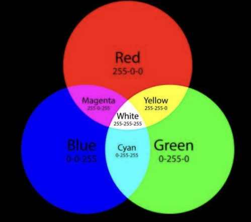

## 16진수 표기가 사용되는 예시
- **색상 표현**
- **컴퓨터 하드웨어 주소 포현**
- **메모리 값 표현**

---

## RGB 색상 표현과 픽셀
  
위에 RGB에서 밑에 255란 숫자가 있다. 이 숫자 어떻게 나온것인가 하면 이 R을 표현하기위해서 **8bit**를 사용한다.  
  
그러면 **8bit**면 총경우의 수는 `2^8 = 256`이다. 즉 값의 범위로 보면 0~부터 255까지 총 256까지를 R이라는 색상을 표현할때 사용한다.  
  
```
0000 0000 -> 0

1111 1111 :
            128 64 32 16 8 4 2 1
            128+64+32+16+8+4+2+1 = 255

```
그래서 전혀 빨간색 같지 않으면 0 매우 빨가면 최대 255까지의 단계를 표현한다.  

---
## CSS에서도 16진수로 색상을 표기한다.

### **색상 코드 해석 방법**

```bash
<!-- 웹에서 흔히 보는 색상 코드들 -->
<div style="color: #FF0000;">빨간 글씨</div>
<div style="background: #00FF00;">초록 배경</div>
<div style="border: 1px solid #0000FF;">파란 테두리</div>
```

**8 비트식 해석한다.**  
**예시: #FF6B35 (주황색)**

| 부분 | 16진수 | 2진수 | 10진수 | 색상 |
| --- | --- | --- | --- | --- |
| **FF** | FF₁₆ | 1111 1111₂ | 255 | 빨강(Red) 최대 |
| **6B** | 6B₁₆ | 0110 1011₂ | 107 | 초록(Green) 중간 |
| **35** | 35₁₆ | 0011 0101₂ | 53 | 파랑(Blue) 약간 |

즉 FF(8bit)는 R, 6B(8bit)는 G, 35(8bit)는 B를 표현한다.

**계산 과정:**

```

6B₁₆ → 10진수 변환:
6₁₆ = 6₁₀
B₁₆ = 11₁₀
6B₁₆ = 6×16¹ + 11×16⁰ = 96 + 11 = 107₁₀

35₁₆ → 10진수 변환:
3₁₆ = 3₁₀
5₁₆ = 5₁₀
35₁₆ = 3×16¹ + 5×16⁰ = 48 + 5 = 53₁₀

```
  
---

## 컴퓨터 하드웨어 주소 표현

### **메모리 주소 (Memory Address)**

```c

// C 프로그래밍에서 포인터 주소
int num = 42;
printf("변수 주소: %p\n", &num);
// 출력: 변수 주소: 0x7fff5fbff6ac// 메모리 주소 해석:
0x7fff5fbff6ac
└─ 0x: 16진수 표시
   7fff5fbff6ac: 실제 메모리 위치

```

**주소 계산 예시:**

```

0x1000 번지부터 시작하는 배열:
int arr[4] = {10, 20, 30, 40};

arr[0] 주소: 0x1000 (4바이트)
arr[1] 주소: 0x1004 (0x1000 + 4)
arr[2] 주소: 0x1008 (0x1000 + 8)
arr[3] 주소: 0x100C (0x1000 + 12)

```

### **MAC 주소 (네트워크 인터페이스)**

```

WiFi 어댑터 MAC 주소: 00:1B:44:11:3A:B7

각 부분 해석:
00₁₆ = 0₁₀     (제조사 식별 코드 시작)
1B₁₆ = 27₁₀
44₁₆ = 68₁₀    (제조사: Intel)
11₁₆ = 17₁₀    (기기 고유 번호)
3A₁₆ = 58₁₀
B7₁₆ = 183₁₀

```

### **포트 번호와 IP 주소**

```

IPv6 주소: 2001:0db8:85a3:0000:0000:8a2e:0370:7334

HTTP 포트: 0x0050 (80₁₀)
HTTPS 포트: 0x01BB (443₁₀)
FTP 포트: 0x0015 (21₁₀)

```

---

## 메모리 값 표현

### **헥스 에디터 (Hex Editor) 화면**

```

주소     16진수 값                     ASCII 표현
0000000: 48 65 6C 6C 6F 20 57 6F     Hello Wo
0000008: 72 6C 64 21 0A 00 00 00     rld!....
0000010: FF FE FD FC FB FA F9 F8     ........
0000018: 00 01 02 03 04 05 06 07     ........

```

**값 해석:**

```

48₁₆ = 72₁₀ = 'H' (ASCII)
65₁₆ = 101₁₀ = 'e' (ASCII)
6C₁₆ = 108₁₀ = 'l' (ASCII)
6C₁₆ = 108₁₀ = 'l' (ASCII)
6F₁₆ = 111₁₀ = 'o' (ASCII)
20₁₆ = 32₁₀ = ' ' (공백)

```

### **프로그램 디버깅 시 메모리 덤프**

```

디버거 출력:
0x401000: 55 8B EC 83 EC 20 C7 45    U.ì.ì Çe
0x401008: FC 00 00 00 00 C7 45 F8    ü....Çeø
0x401010: 01 00 00 00 8B 45 F8 83    ....‹eø.

어셈블리 명령어로 해석:
55₁₆ = PUSH EBP
8B EC₁₆ = MOV ESP, EBP
83 EC 20₁₆ = SUB ESP, 32

```

### **레지스터 값 표현**

```

CPU 레지스터 상태:
EAX: 0x12345678
EBX: 0xABCDEF00
ECX: 0x00FF00FF
EDX: 0xDEADBEEF  ← 유명한 디버깅 값

플래그 레지스터:
FLAGS: 0x0246
       ||||└─ CF (Carry Flag): 0
       |||└── PF (Parity Flag): 1
       ||└─── AF (Auxiliary Flag): 1
       |└──── ZF (Zero Flag): 0
       └───── SF (Sign Flag): 0

```

## 🔧 실무에서 16진수를 사용하는 이유

### **1. 간결성**

```

2진수: 1111111111111111 (16비트)
16진수: FFFF (동일한 값, 훨씬 짧음)

```

### **2. 바이트 단위 표현**

```

1바이트 = 8비트 = 2자리 16진수
메모리는 바이트 단위로 관리되므로 16진수가 자연스러움

예: 256바이트 = 00 01 02 03 ... FE FF

```

### **3. 비트 패턴 인식**

```

권한 설정 (Unix):
rwxrwxrwx = 111111111₂ = 777₈ = 1FF₁₆

파일 속성:
-rw-r--r-- = 110100100₂ = 644₈ = 1A4₁₆

```

### **4. 하드웨어 레지스터 조작**

```

GPIO 포트 제어:
포트 0x378에 0xFF 쓰기 → 모든 핀 HIGH
포트 0x378에 0x00 쓰기 → 모든 핀 LOW
포트 0x378에 0xAA 쓰기 → 교대로 HIGH/LOW

```