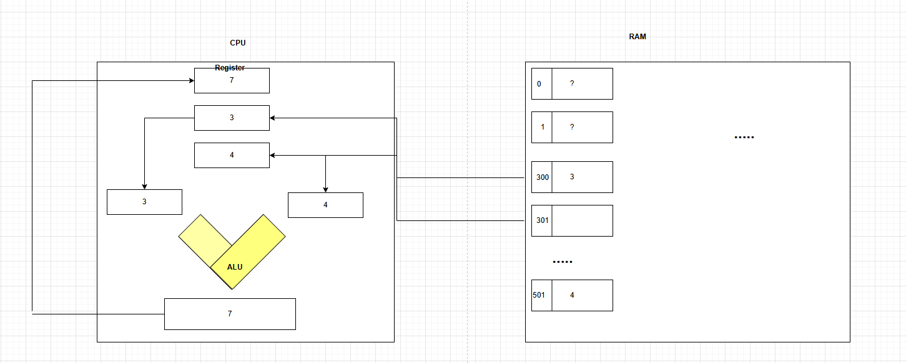

## 컴퓨터가 연산하는 과정

## 컴퓨터 구성 요소의 역할 분류

### **메모리 계층 구조**

**CPU 연산장치 (비메모리)**

- **ALU (Arithmetic Logic Unit)**: 실제 계산 수행
- **Register**: 초고속 임시 저장 공간
- **Control Unit**: 명령어 해석 및 제어

**RAM 저장장치 (1차메모리)**

- **주기억장치**: 현재 실행 중인 프로그램과 데이터 저장
- **휘발성**: 전원이 꺼지면 데이터 소실
- **고속 접근**: CPU와 직접 연결

**추가적인 보조 기억장치 SSD, HDD (2차메모리)**

- **보조기억장치**: 영구 데이터 저장
- **비휘발성**: 전원이 꺼져도 데이터 유지
- **대용량**: TB 단위 저장 가능

**메모리 계층별 특성 비교:**

```

속도와 용량의 트레이드오프:

CPU Register:
- 속도: 1 클록 (가장 빠름)
- 용량: 수십 개 (32-64비트 × 16-32개)
- 가격: 매우 비쌈

RAM (DRAM):
- 속도: 수십-수백 클록
- 용량: GB 단위
- 가격: 비쌈

SSD:
- 속도: 수만 클록
- 용량: TB 단위
- 가격: 보통

HDD:
- 속도: 수십만 클록 (가장 느림)
- 용량: TB 단위 (가장 큼)
- 가격: 저렴

```

## 📍 RAM의 주소 체계

**RAM은 마치 엑셀의 셀의 위치를 표시할 때처럼 일정한 일련번호가 존재하고 해당 일련번호마다 공간이 존재한다. 그리고 그 공간에 정보를 저장한다.**

**메모리 주소 체계의 실제 모습:**

```

RAM 구조 (Excel 셀과 비교):

Excel:          메모리:
A1, A2, A3...   0x00000000, 0x00000001, 0x00000002...
B1, B2, B3...   0x00000100, 0x00000101, 0x00000102...

메모리 주소 예시:
주소        값 (8비트)    의미
0x00000000: 01001000    'H' (ASCII 72)
0x00000001: 01100101    'e' (ASCII 101)
0x00000002: 01101100    'l' (ASCII 108)
0x00000003: 01101100    'l' (ASCII 108)
0x00000004: 01101111    'o' (ASCII 111)
0x00000005: 00000000    '\0' (문자열 끝)

```

**주소와 데이터의 관계:**

```

메모리 셀 구조:
┌─────────────┬─────────────┐
│   주소      │    데이터    │
├─────────────┼─────────────┤
│ 0x00001000  │ 00001010    │ ← 10이라는 숫자 저장
│ 0x00001001  │ 00001111    │ ← 15라는 숫자 저장
│ 0x00001002  │ 00000000    │ ← 0이라는 숫자 저장
│ 0x00001003  │ 11111111    │ ← 255라는 숫자 저장
└─────────────┴─────────────┘

각 주소는 보통 1바이트(8비트) 단위로 관리

```

## 🔧 CPU 레지스터와 데이터 처리

**이렇게 특정 공간에 위치한 데이터 가져와서 CPU는 Register라는 임시 공간에 담아 둔다.**

**레지스터의 종류와 역할:**

```

Intel x86-64 주요 레지스터:

범용 레지스터 (64비트):
- RAX: 누산기 (Accumulator) - 연산 결과 저장
- RBX: 베이스 (Base) - 메모리 주소 계산
- RCX: 카운터 (Counter) - 반복문 카운터
- RDX: 데이터 (Data) - 곱셈/나눗셈 확장

특수 레지스터:
- RSP: 스택 포인터 (Stack Pointer)
- RBP: 베이스 포인터 (Base Pointer)
- RSI/RDI: 소스/목적지 인덱스
- RIP: 명령어 포인터 (Instruction Pointer)

```

**데이터 로딩 과정 상세:**

```

메모리 → 레지스터 로딩 과정:

1단계: CPU가 메모리 주소 0x00001000에 접근 요청
2단계: 메모리 컨트롤러가 해당 주소의 데이터 읽기
3단계: 데이터 버스를 통해 CPU로 전송
4단계: CPU가 레지스터 RAX에 데이터 저장

어셈블리 명령어:
MOV RAX, [0x00001000]  ; 메모리 → 레지스터

```
  

**레지스터에 담아둔 데이터를 ALU(연산)을 통해 결과를 도출하고 그 결과를 다시 Register에 저장하고 필요하다면 해당 데이터를 실제 메모리 공간에 저장한다.**

**ALU 연산 과정:**

```

예시: 10 + 15 = 25 계산

1단계: 데이터 준비
RAX = 10 (메모리 0x00001000에서 로드)
RBX = 15 (메모리 0x00001001에서 로드)

2단계: ALU 연산
ALU 입력: RAX(10), RBX(15), 연산(ADD)
ALU 출력: 25

3단계: 결과 저장
RAX = 25 (ALU 결과를 RAX에 저장)

4단계: 메모리 저장 (필요시)
MOV [0x00001002], RAX  ; 결과를 메모리에 저장

```

**ALU 내부 구조:**

```

ALU 구성 요소:
┌─────────────────────────────┐
│          ALU                │
│  ┌─────┐ ┌─────┐ ┌─────┐   │
│  │AND  │ │ OR  │ │XOR  │   │ ← 논리 연산
│  └─────┘ └─────┘ └─────┘   │
│  ┌─────┐ ┌─────┐ ┌─────┐   │
│  │ADD  │ │SUB  │ │MUL  │   │ ← 산술 연산
│  └─────┘ └─────┘ └─────┘   │
│  ┌─────┐ ┌─────┐           │
│  │SHL  │ │SHR  │           │ ← 시프트 연산
│  └─────┘ └─────┘           │
└─────────────────────────────┘

```

## 32비트 메모리 주소 한계

**이 일련번호는 대략 42억 9천만 정도 되는데 이는 2의 32제곱이다. 이는 32bit 체계에서는 4기가바이트까지 밖에 인식하지 못한다.**

**32비트 주소 체계의 수학적 분석:**

```

32비트 주소 공간:
2³² = 4,294,967,296 (약 43억)

각 주소가 1바이트를 가리키므로:
4,294,967,296 바이트 = 4,096 MB = 4 GB

주소 범위:
최소: 0x00000000 = 0
최대: 0xFFFFFFFF = 4,294,967,295

비트별 분해:
11111111 11111111 11111111 11111111
└─ 8비트 ─┘└─ 8비트 ─┘└─ 8비트 ─┘└─ 8비트 ─┘
   FF        FF        FF        FF

```

**실제 메모리 사용 제약:**

```

32비트 Windows 시스템:
- 이론적 최대: 4GB
- 실제 사용 가능: 약 3.2-3.5GB
- 제한 이유: 시스템 예약 영역

메모리 맵 예시:
0x00000000 - 0x7FFFFFFF: 사용자 공간 (2GB)
0x80000000 - 0xFFFFFFFF: 커널 공간 (2GB)

실제 할당:
- 시스템 BIOS: 일부 영역 예약
- 하드웨어 주소: GPU, 사운드카드 등
- 커널 영역: 운영체제 전용

```

**64비트로의 확장:**

```

64비트 주소 공간:
2⁶⁴ = 18,446,744,073,709,551,616 바이트
     = 16 EB (엑사바이트)
     = 16,777,216 TB
     = 17,179,869,184 GB

현실적 제약:
- 현재 CPU는 48비트만 사용 (256TB)
- 운영체제별 제한 존재
- 실제 필요량과 기술적 한계

```

## 데이터 복제와 이동 과정

**여기서 핵심은 메모리쪽에서 CPU로 데이터가 복제되서 넘어간다. 그 연산결과를 다시 메모리에 저장한다.**

**데이터 복제의 상세 과정:**

```

단계별 데이터 흐름:

1단계: 메모리 읽기 (복제)
메모리 주소 0x1000: [00001010] (값: 10)
                     ↓ 복사
CPU 레지스터 RAX:    [00001010] (값: 10)

메모리의 원본 데이터는 그대로 유지!

2단계: 연산 수행
RAX (10) + RBX (15) = RAX (25)

3단계: 결과 저장 (덮어쓰기)
CPU 레지스터 RAX:    [00011001] (값: 25)
                     ↓ 복사
메모리 주소 0x1002:  [00011001] (값: 25)

```

**실제 명령어 수준에서의 과정:**

```

C 코드:
int a = 10;      // 메모리에 10 저장
int b = 15;      // 메모리에 15 저장
int c = a + b;   // 연산 후 결과 저장

어셈블리 변환:
MOV RAX, [메모리_a]    ; a 값을 RAX로 복사
MOV RBX, [메모리_b]    ; b 값을 RBX로 복사
ADD RAX, RBX           ; RAX = RAX + RBX
MOV [메모리_c], RAX    ; 결과를 메모리로 복사

메모리 상태 변화:
실행 전: a=10, b=15, c=?
실행 후: a=10, b=15, c=25 (원본 a,b는 변경 없음)

```

**버스 시스템을 통한 데이터 전송:**

```

CPU와 메모리 간 통신:

주소 버스 (32비트 시스템):
CPU → 메모리: "0x00001000 주소에 접근하고 싶음"

제어 버스:
CPU → 메모리: "읽기 요청" 또는 "쓰기 요청"

데이터 버스 (32비트 시스템):
메모리 → CPU: [00001010] (읽기 시)
CPU → 메모리: [00011001] (쓰기 시)

버스 폭과 성능:
- 32비트 버스: 한 번에 4바이트 전송
- 64비트 버스: 한 번에 8바이트 전송
- 더 넓은 버스 = 더 빠른 데이터 전송

```

##  실제 연산 과정 종합 예시

**전체 과정을 하나의 예시로 정리:**

```

문제: 메모리에 저장된 두 수 7과 3을 더해서 결과를 저장

초기 메모리 상태:
주소 0x1000: 00000111 (7)
주소 0x1001: 00000011 (3)
주소 0x1002: ???????? (결과 저장 예정)

1단계: 첫 번째 피연산자 로드
CPU 명령: MOV RAX, [0x1000]
- 주소 버스: 0x1000 전송
- 제어 버스: READ 신호
- 데이터 버스: 00000111 수신
- RAX 레지스터: 00000111 저장

2단계: 두 번째 피연산자 로드
CPU 명령: MOV RBX, [0x1001]
- 주소 버스: 0x1001 전송
- 제어 버스: READ 신호
- 데이터 버스: 00000011 수신
- RBX 레지스터: 00000011 저장

3단계: ALU 연산 수행
CPU 명령: ADD RAX, RBX
- ALU 입력: RAX(7), RBX(3)
- 전가산기 동작: 7 + 3 = 10
- ALU 출력: 00001010 (10)
- RAX 레지스터: 00001010 저장

4단계: 결과 메모리 저장
CPU 명령: MOV [0x1002], RAX
- 주소 버스: 0x1002 전송
- 제어 버스: WRITE 신호
- 데이터 버스: 00001010 전송
- 메모리 저장 완료

최종 메모리 상태:
주소 0x1000: 00000111 (7) ← 변경 없음
주소 0x1001: 00000011 (3) ← 변경 없음
주소 0x1002: 00001010 (10) ← 결과 저장됨

```

## 🔄 메모리 관리와 성능 최적화

**캐시 메모리의 역할:**

```

CPU와 RAM 사이의 속도 차이 해결:

L1 캐시 (가장 빠름):
- 크기: 32-64KB
- 속도: 1-2 클록
- CPU 코어마다 전용

L2 캐시:
- 크기: 256KB-1MB
- 속도: 3-10 클록
- 코어별 또는 공유

L3 캐시 (가장 큼):
- 크기: 8-32MB
- 속도: 10-20 클록
- 모든 코어 공유

캐시 히트/미스:
- 히트: 캐시에서 데이터 발견 (빠름)
- 미스: RAM에서 데이터 로드 (느림)

```

**가상 메모리 시스템:**

```

물리 메모리 한계 극복:

가상 주소 → 물리 주소 변환:
프로그램이 보는 주소: 0x08048000
실제 RAM 주소: 0x12345000

페이징 시스템:
- 4KB 단위로 메모리 분할
- 사용하지 않는 페이지는 디스크로 이동
- 필요할 때 다시 RAM으로 로드

스왑 파일:
- RAM이 부족할 때 디스크 사용
- 느리지만 더 큰 가상 공간 제공

```

## 🎯 핵심 요약

1. **메모리 계층**: Register(가장 빠름) → RAM → Storage(가장 느림)
2. **주소 체계**: 32비트=4GB 한계, 64비트=거의 무제한
3. **데이터 복제**: 메모리→레지스터→ALU→레지스터→메모리 순환
4. **연산 과정**: 로드→연산→저장의 3단계 사이클
5. **버스 시스템**: 주소/데이터/제어 버스를 통한 통신
6. **성능 최적화**: 캐시와 가상 메모리로 속도와 용량 문제 해결