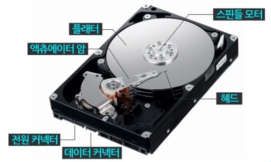
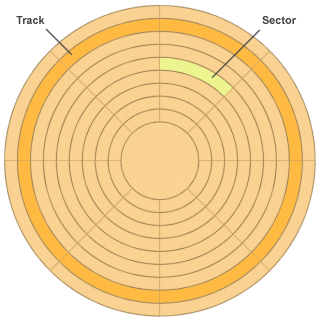

## 디스크
  


# 하드디스크(HDD)의 구조와 동작 원리

## 하드디스크의 물리적 구조

### **하드디스크의 스펙 - 레지스터는 중요해서 이름이 다 있음**

**하드디스크 vs 레지스터 관리 체계:**

```

레지스터 (CPU 내부):
- 개수: 16-32개 (매우 소량)
- 관리: 고유 이름 (RAX, RBX, RCX...)
- 접근: 직접 명명으로 즉시 접근
- 용도: 연산 중 임시 데이터 저장

하드디스크 (대용량 저장):
- 용량: TB 단위 (수십억 섹터)
- 관리: 트랙/섹터 번호 (좌표 체계)
- 접근: 물리적 이동 + 회전 대기
- 용도: 영구 데이터 저장

```

**주기억장치 RAM보다 더 많은 공간을 가진 값싼 메모리가 2차 메모리임**

**메모리 계층별 용량과 가격 비교:**

```

용량과 비용의 관계:

Register:   수십 개    × 매우 비쌈    = CPU 전용
Cache:      MB 단위    × 비쌈         = 고속 임시저장
RAM:        GB 단위    × 보통         = 주기억장치
HDD/SSD:    TB 단위    × 저렴         = 2차 저장장치

실제 비교 (2024년 기준):
- RAM: 약 $3-5/GB
- SSD: 약 $0.1-0.3/GB
- HDD: 약 $0.02-0.05/GB
→ HDD가 가장 저렴한 대용량 저장 매체

```

**하드디스크는 자기 디스크 원판에 마그네틱에다가 자성 정보를 저장하는 방식임**

### **자기 저장 방식의 원리**

**자성을 이용한 데이터 저장:**

```

자성 저장 원리:
- 플래터 표면: 자성 물질 (산화철) 코팅
- 데이터 표현: 자기장 방향으로 0과 1 구분
- 읽기: 헤드가 자기장 변화 감지
- 쓰기: 헤드가 자기장 방향 변경

자기장 방향:
0: 북극(N) → 남극(S) 방향
1: 남극(S) → 북극(N) 방향

장점:
- 전원 없어도 자성 유지 (비휘발성)
- 대용량 저장 가능
- 상대적으로 저렴한 비용

단점:
- 기계적 동작으로 인한 속도 제한
- 충격에 민감
- 소음과 발열 발생

```

## 하드디스크의 속도와 성능

**하드디스크의 스펙을 논할 때 속도는 디스크 회전 속도를 얘기함**

**RPM (Revolutions Per Minute) 상세:**

```

회전 속도별 특성:

5400 RPM (노트북용):
- 회전 주기: 11.1ms (1분/5400회)
- 평균 대기: 5.55ms
- 장점: 저전력, 저소음, 저발열
- 단점: 느린 접근 속도

7200 RPM (데스크톱 표준):
- 회전 주기: 8.33ms
- 평균 대기: 4.17ms
- 장점: 적당한 성능과 전력 균형
- 용도: 일반 데스크톱, 게임

10000 RPM (고성능):
- 회전 주기: 6ms
- 평균 대기: 3ms
- 장점: 빠른 접근 속도
- 단점: 높은 전력, 소음, 발열

15000 RPM (서버용):
- 회전 주기: 4ms
- 평균 대기: 2ms
- 용도: 미션 크리티컬 서버
- 특징: 최고 성능, 높은 비용

```

**접근 시간 구성 요소:**

```

총 접근 시간 = 탐색 시간 + 회전 대기 + 전송 시간

탐색 시간 (Seek Time):
- 헤드가 목표 트랙까지 이동하는 시간
- 평균: 8-15ms
- 최대: 20-25ms (가장 먼 트랙)

회전 대기 시간 (Rotational Latency):
- 목표 섹터가 헤드 아래 올 때까지 대기
- 평균: 회전 주기의 50%
- 7200 RPM: 평균 4.17ms

전송 시간 (Transfer Time):
- 실제 데이터 읽기/쓰기 시간
- 현대 HDD: 100-200 MB/s
- 상대적으로 가장 빠름

```

### **헬륨 가스를 넣는 이유**

**마찰하게 되면 고속회전하다 보니까 헤드 자체가 불타버리는 수가 있음 그걸 막으려고 헬륨 가스를 넣음**

**헬륨 충진 HDD의 장점:**

```

공기 vs 헬륨 비교:

공기 충진 (일반 HDD):
- 밀도: 높음 (질소 78%, 산소 21%)
- 마찰: 크고 저항 높음
- 문제점: 고속회전 시 와류, 진동, 발열

헬륨 충진 (고급 HDD):
- 밀도: 공기의 1/7 (훨씬 가벼움)
- 마찰: 현저히 낮음
- 안정성: 화학적으로 불활성

헬륨의 구체적 효과:
1. 마찰 감소 → 전력 소모 23% 절약
2. 진동 감소 → 더 정밀한 헤드 제어
3. 발열 감소 → 안정성과 수명 향상
4. 소음 감소 → 조용한 동작
5. 플래터 증설 → 같은 공간에 더 많은 용량

```

**고밀도 저장의 필요성:**

```

데이터센터 요구사항:
- 공간당 최대 용량 ($/TB 최적화)
- 전력 효율성 (냉각 비용 절약)
- 높은 신뢰성 (24/7 가동)

헬륨 HDD 적용:
- 일반: 3-4TB (5-7 플래터)
- 헬륨: 8-20TB (8-10 플래터)
- 밀도 향상으로 경쟁력 확보

```

## 트랙과 섹터 관리 체계

**섹터라는 개념으로 관리 체계를 나눔 섹터에 정보를 기술함**

### **물리적 구조의 이해**

**트랙(Track)과 섹터(Sector) 시스템:**

```

트랙 (Track):
- 정의: 플래터 표면의 동심원
- 개수: 수만~수십만 개
- 특징: 바깥쪽일수록 물리적 크기 큼

섹터 (Sector):
- 정의: 트랙을 나눈 최소 저장 단위
- 크기: 전통적으로 512바이트
- 최신: 4KB (4096바이트) 고급 포맷

실린더 (Cylinder):
- 정의: 여러 플래터의 같은 위치 트랙들
- 용도: 헤드 이동 없이 접근 가능한 영역
- 효율성: 같은 실린더 내 데이터는 빠른 접근

```

**CHS vs LBA 주소 체계:**

```

CHS (Cylinder-Head-Sector):
물리적 주소 체계 (전통적 방식)
- C: 실린더 번호 (트랙 그룹)
- H: 헤드 번호 (플래터 면)
- S: 섹터 번호 (트랙 내 위치)

예시: C=100, H=1, S=15
→ 100번째 실린더, 1번째 헤드, 15번째 섹터

LBA (Logical Block Address):
논리적 주소 체계 (현대적 방식)
- 순차적 번호: 0, 1, 2, 3...
- 물리적 구조 숨김
- OS 및 소프트웨어가 사용

LBA → CHS 변환:
LBA = (C × 헤드수 × 섹터수) + (H × 섹터수) + (S-1)

```

## 디스크 조각 모음과 최적화

**디스크 조각 모음 - 하드디스크를 사용할 때는 정보가 빈 공간을 위주로 채워서 사용함**

### **파일 조각화 현상**

**조각화가 발생하는 이유:**

```

파일 저장 과정:
1. 새 파일 생성 → 연속된 빈 공간에 저장
2. 파일 삭제 → 중간중간 빈 공간 생성
3. 새 파일 저장 → 빈 공간에 분산 저장
4. 반복 → 파일이 여러 곳에 흩어짐

조각화 예시:
파일 A: 섹터 100-102 (연속)
파일 B: 섹터 103-105 (연속)
파일 C: 섹터 106-108 (연속)

파일 B 삭제 후:
빈 공간: 섹터 103-105

새 파일 D (5 섹터 필요):
→ 섹터 103-105, 109-110에 분산 저장
→ 조각화 발생!

```

**베드 섹터는 물리적으로 사용할 수 없게 되는 것임**

**베드 섹터 관리:**

```

베드 섹터 발생 원인:
- 플래터 표면 손상
- 자성 물질 열화
- 헤드 충돌 (Head Crash)
- 진동이나 충격

HDD 자체 관리 기능:
- SMART (Self-Monitoring Analysis Reporting Technology)
- 자동 재할당: 베드 섹터 발견 시 예비 섹터로 교체
- 에러 정정 코드 (ECC): 작은 오류 자동 수정

베드 섹터 증가 패턴:
초기: 가끔 발생, 자동 처리로 정상 동작
중기: 빈발 발생, 성능 저하 시작
말기: 대량 발생, 데이터 손실 위험

```

### **조각 모음의 효과와 원리**

**조각 모음을 하면 입출력 성능이 좋아짐조각 모음을 하면 디스크가 한 번 회전할 때 전체 데이터를 한 방에 읽을 수 있음**

**성능 향상 메커니즘:**

```

조각화된 파일 읽기:
1. 첫 번째 조각 위치로 헤드 이동 (탐색 시간)
2. 회전 대기 후 데이터 읽기
3. 두 번째 조각 위치로 헤드 이동 (추가 탐색)
4. 다시 회전 대기 후 데이터 읽기
→ 총 시간: 탐색×n + 회전대기×n + 전송

조각 모음 후 연속 파일 읽기:
1. 파일 시작 위치로 헤드 이동 (1회 탐색)
2. 회전 대기 후 전체 데이터 순차 읽기
→ 총 시간: 탐색×1 + 회전대기×1 + 전송

성능 향상:
- 탐색 시간: 70-90% 감소
- 전체 읽기 시간: 50-80% 단축

```

**조각 모음 알고리즘:**

```

Windows 디스크 조각 모음:
1. 파일 분석: 조각화 정도 측정
2. 파일 이동: 연속 공간으로 재배치
3. 빈 공간 통합: 큰 연속 공간 생성
4. 시스템 파일 최적화: 자주 사용하는 파일을 빠른 위치에

Linux 파일시스템:
- ext4: 지연 할당으로 조각화 최소화
- 자동 조각 모음: 실시간으로 최적화
- 예약 공간: 조각화 방지를 위한 버퍼

```

## 파일 시스템과 할당 테이블

**파일 얼로케이션 테이블 파일 얼로케이션 테이블은 파일의 위치를 알려주는 것으로 파일 시스템 종류가 다 가지고 있음**

### **파일 할당 테이블의 구조**

**FAT (File Allocation Table) 시스템:**

```

FAT 테이블 구조:
클러스터 번호 | 다음 클러스터 | 상태
-------------|--------------|-------
0            | 예약          | 시스템
1            | 예약          | 시스템
2            | 3            | 파일 A
3            | 4            | 파일 A
4            | EOF          | 파일 A 끝
5            | FREE         | 사용 가능
6            | 7            | 파일 B
7            | EOF          | 파일 B 끝

파일 읽기 과정:
1. 디렉토리에서 파일 이름으로 시작 클러스터 찾기
2. FAT 테이블에서 해당 클러스터 확인
3. 다음 클러스터 번호 따라가며 순차 읽기
4. EOF (End of File) 만날 때까지 반복

```

**NTFS (New Technology File System):**

```

MFT (Master File Table) 구조:
- 각 파일마다 MFT 엔트리 존재
- 파일 정보를 레코드 형태로 저장
- 작은 파일: MFT 내부에 직접 저장
- 큰 파일: 외부 클러스터 위치 정보만 저장

MFT 레코드 구성:
- 표준 정보: 생성/수정 시간, 속성
- 파일명: 긴 파일명과 8.3 형식 모두 지원
- 데이터: 파일 내용 또는 위치 정보
- 보안: 접근 권한 정보
- 인덱스: 디렉토리 구조 정보

```

### **파일 삭제와 복원 원리**

**파일 얼로케이션 테이블은 메타 데이터 관리 정보라고 할 수 있는 관리 체계가 있을 텐데 이 관리 체계상에서 지워졌다라고 마킹이 된 것뿐임**

**실제로 디스크에서 완전히 지워지는 게 아니죠. 지워졌다고 마킹만 되는 겁니다.**

**파일 삭제 과정:**

```

1단계: 파일 삭제 명령
사용자가 "파일 삭제" 실행

2단계: 디렉토리 엔트리 수정
파일명의 첫 글자를 특수 문자로 변경
(예: "document.txt" → "∞ocument.txt")

3단계: FAT 테이블 수정
해당 클러스터들을 "FREE" 상태로 변경
클러스터 2 → FREE
클러스터 3 → FREE
클러스터 4 → FREE

4단계: 실제 데이터는 그대로 유지
클러스터의 실제 내용은 변경하지 않음
새 파일이 덮어쓸 때까지 원본 데이터 보존

```

**파일 복원 과정:**

```

복원 프로그램의 동작:
1. 삭제된 파일 탐지
   - 디렉토리에서 삭제 마킹된 엔트리 찾기
   - 파일 크기와 시작 클러스터 정보 확인

2. 클러스터 체인 재구성
   - 파일 크기로부터 필요한 클러스터 수 계산
   - 시작 클러스터부터 순차적으로 체인 구성
   - 중간에 다른 파일이 덮어썼는지 확인

3. 데이터 검증 및 복원
   - 복원된 데이터의 무결성 검사
   - 파일 헤더 정보로 파일 타입 확인
   - 정상적인 파일 구조인지 검증

복원 성공률:
- 즉시 복원: 90-100%
- 1주일 후: 70-90%
- 1개월 후: 30-70%
- 새 데이터 기록량에 따라 결정

```

## 마스터 부트 레코드와 부팅

**0번 트랙 0번 섹터입니다. 그래서 이게 만약에 이제 트랙 번호가 0번 트랙이고 0번 섹터다. 그럼 이거 뭐라고 부르냐면은 마스터 부트 레코드라고 불러요.**

### **MBR (Master Boot Record) 구조**

**MBR의 구성 요소:**

```

MBR 섹터 (512바이트) 구성:
바이트 0-445:   부트 코드 (446바이트)
바이트 446-509: 파티션 테이블 (64바이트, 4개 파티션×16바이트)
바이트 510-511: 부트 시그니처 (0x55AA)

부트 코드 역할:
- 기본적인 하드웨어 초기화
- 활성 파티션 찾기
- 해당 파티션의 부트 섹터로 제어권 이전

파티션 테이블 정보:
각 파티션별 16바이트:
- 부트 플래그 (활성/비활성)
- 시작 CHS 주소
- 파티션 타입 (NTFS, FAT32 등)
- 끝 CHS 주소
- 시작 LBA 주소
- 파티션 크기

```

**부팅 과정 상세:**

```

1단계: POST (Power-On Self Test)
- CPU, 메모리, 하드웨어 기본 검사
- BIOS/UEFI 펌웨어 초기화

2단계: 부트 디바이스 찾기
- BIOS 설정의 부트 우선순위 확인
- 첫 번째 부트 디바이스의 MBR 읽기

3단계: MBR 로딩 및 실행
- 0번 트랙, 0번 섹터 (MBR) 메모리로 로딩
- 0x7C00 주소에 MBR 코드 적재
- MBR 부트 코드 실행 시작

4단계: 운영체제 로더 찾기
- 활성 파티션의 부트 섹터 읽기
- 운영체제별 부트로더 (BOOTMGR, GRUB 등) 실행

5단계: 운영체제 커널 로딩
- 부트로더가 OS 커널 파일 찾기
- 커널을 메모리에 로딩하고 실행권 이전
- 운영체제 초기화 완료

```

**마스터 부트 레코드의 보호 마스터 부트 레코드 같은 경우는 여러 차원에서 보호를 함**

**MBR 보안 메커니즘:**

```

하드웨어 수준 보호:
- BIOS/UEFI 잠금: 부트 순서 변경 방지
- Secure Boot: 서명된 부트로더만 실행
- 하드웨어 암호화: 디스크 전체 암호화

소프트웨어 수준 보호:
- 부트 바이러스 스캔: 백신의 실시간 감시
- 부트 섹터 백업: 원본 MBR 별도 보관
- 무결성 검사: 해시값으로 변조 탐지

악성코드로부터 보호:
- 부트킷 (Bootkit) 방지
- 루트킷 사전 차단
- 시스템 복원 지점 생성

```

## 포맷의 종류와 SSD 특성

### **빠른 포맷 vs 느린 포맷**

**빠른 포맷은 전체 트랙과 섹터를 찾아서 전부 다 0으로 오버라이트를 해야 느린 포맷이 됨**

**포맷 방식 비교:**

```

빠른 포맷 (Quick Format):
1. 파일 시스템 메타데이터만 초기화
2. FAT/MFT 테이블 새로 생성
3. 루트 디렉토리 구조 생성
4. 실제 데이터 영역은 건드리지 않음
5. 시간: 수 초~수 분

느린 포맷 (Full Format):
1. 전체 디스크 표면 스캔
2. 모든 섹터를 0으로 덮어쓰기
3. 베드 섹터 검사 및 마킹
4. 파일 시스템 메타데이터 생성
5. 시간: 수 시간 (용량에 따라)

보안 측면:
빠른 포맷: 기존 데이터 복원 가능
느린 포맷: 데이터 완전 삭제, 복원 불가

```

### **SSD의 혁신적 특성**

**SSD는 디스크가 회전하는 게 아니고 어디를 가든 칩에 의해서 컨트롤 해가지고 바로바로 치고 들어가다 보니까 속도가 굉장히 빠르고 물리적인 게 아니라 칩 자체의 읽기 쓰기 성능에 따라서 결정이 남**

**SSD vs HDD 동작 원리:**

```

HDD (기계적 동작):
1. 헤드를 목표 트랙으로 이동 (탐색 시간)
2. 플래터 회전으로 섹터 대기 (회전 지연)
3. 자기 헤드로 데이터 읽기/쓰기
→ 순차 접근이 유리, 랜덤 접근 느림

SSD (전자적 동작):
1. 컨트롤러가 주소 해석
2. NAND 플래시 메모리 직접 접근
3. 전기 신호로 즉시 읽기/쓰기
→ 랜덤 접근 = 순차 접근 (동일한 속도)

성능 비교:
              HDD        SSD
순차 읽기:    100MB/s    500MB/s+
랜덤 읽기:    1MB/s      500MB/s+
접근 시간:    10ms       0.1ms
IOPS:         100        10,000+

```

**SSD의 고유한 특성:**

```

NAND 플래시 메모리 특성:
- 셀 타입: SLC(빠름) > MLC > TLC > QLC(느림)
- 프로그램/소거 사이클: 유한한 쓰기 수명
- 웨어 레벨링: 균등한 마모 분산

컨트롤러 역할:
- 논리→물리 주소 변환 (FTL)
- 가비지 컬렉션: 무효 데이터 정리
- ECC (Error Correction): 오류 정정
- TRIM 명령: 삭제된 블록 관리

SSD 최적화 기법:
- 오버프로비저닝: 여유 공간 확보
- 캐시 버퍼: 쓰기 성능 향상
- 압축: 실제 저장량 절약
- 중복 제거: 동일 데이터 통합

```

**핵심 원리 정리:**

1. **물리적 구조**: 트랙/섹터 시스템으로 정확한 주소 지정
2. **자성 저장**: 비휘발성 대용량 저장의 핵심 기술
3. **기계적 한계**: 회전과 이동으로 인한 속도 제약
4. **파일 시스템**: 물리적 저장과 논리적 구조의 추상화
5. **SSD 혁신**: 전자적 접근으로 기계적 한계 극복